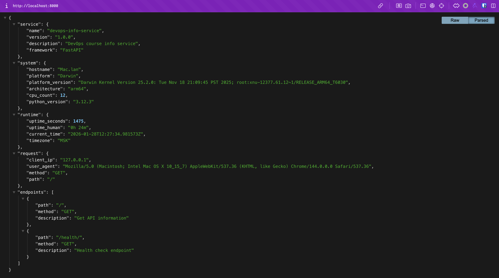
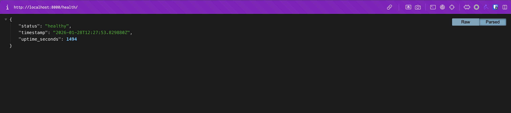
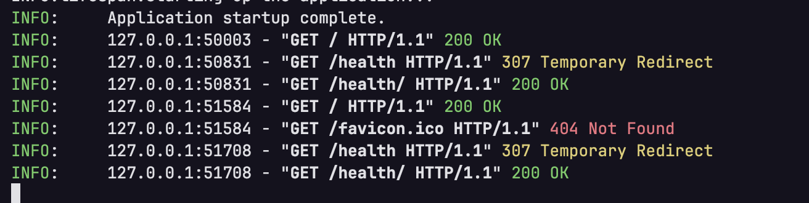

# Lab 1 — DevOps Info Service: Web Application Development

## Table of Contents

- [Framework Selection](#framework-selection)
    - [Alternative Frameworks](#alternative-frameworks)
- [Best Practices Applied](#best-practices-applied)
- [API Documentation](#api-documentation)
    - [Request/response examples](#requestresponse-examples)
    - [Testing commands](#testing-commands)
- [Testing Evidence](#testing-evidence)
- [Challenges & Solutions](#challenges--solutions)

## Framework Selection

I choose to use **FastAPI** for this lab because it is a modern, fast, natively support asyncio and I have experience
with it.

### Alternative Frameworks

--------

| Framework   | Description                                                                                                              | Advantages                                                              | Disadvantages                                                                        |
|-------------|--------------------------------------------------------------------------------------------------------------------------|-------------------------------------------------------------------------|--------------------------------------------------------------------------------------|
| **FastAPI** | A modern, fast (high-performance), web framework for building APIs with Python 3.7+ based on standard Python type hints. | High performance, easy to use, automatic interactive API documentation. | Relatively new, smaller community compared to Flask and Django.                      |
| Flask       | A lightweight WSGI web application framework in Python.                                                                  | Simple and easy to use, large community, many extensions available.     | Limited built-in features, may require additional libraries for larger applications. |
| Django      | A high-level Python web framework that encourages rapid development and clean, pragmatic design                          | Batteries-included, robust admin interface, strong security features.   | Can be monolithic and heavyweight for small applications, steeper learning curve.    |
| Bottle      | A fast, simple and lightweight WSGI micro web-framework for Python.                                                      | Single file, minimal dependencies, easy to deploy.                      | Limited functionality, not suitable for large applications.                          |
| Pyramid     | A lightweight, "start small, finish big" Python web framework.                                                           | Flexible and scalable, good for both small and large applications.      | Smaller community compared to Flask and Django, less documentation available.        |

--------

## Best Practices Applied

- **Project Structure**: Organized the project with a clear structure separating application code, configuration, and
  documentation.
- **Environment Configuration**: Used environment variables for configuration settings to enhance security and
  flexibility.
- **Dependency Management**: Listed all dependencies in a `requirements.txt` file for easy installation
- **FastAPI Features**: Leveraged FastAPI's automatic data validation and serialization using Pydantic models.
  Dependency injection for better modularity and testability. Domain-driven design principles to separate concerns and
  improve maintainability.

## API Documentation

The API is documented using FastAPI's built-in interactive documentation, which is automatically generated based on
the code and Pydantic models. The documentation is accessible at the `/docs` endpoint when the application is running.

### Request/response examples

- **GET /**

    - **Description**: Service and system information.
        - **Response**:
          ```json
          {
              "service": {
                "name": "devops-info-service",
                "version": "1.0.0",
                "description": "DevOps course info service",
                "framework": "FastAPI"
              },
              "system": {
                "hostname": "Mac.lan",
                "platform": "Darwin",
                "platform_version": "Darwin Kernel Version 25.2.0: Tue Nov 18 21:09:45 PST 2025; root:xnu-12377.61.12~1/RELEASE_ARM64_T6030",
                "architecture": "arm64",
                "cpu_count": 12,
                "python_version": "3.12.3"
              },
              "runtime": {
                "uptime_seconds": 1276,
                "uptime_human": "0h 21m",
                "current_time": "2026-01-28T12:24:16.262608Z",
                "timezone": "MSK"
              },
              "request": {
                "client_ip": "127.0.0.1",
                "user_agent": "Mozilla/5.0 (Macintosh; Intel Mac OS X 10_15_7) AppleWebKit/537.36 (KHTML, like Gecko) Chrome/144.0.0.0 Safari/537.36",
                "method": "GET",
                "path": "/"
              },
              "endpoints": [
                {
                  "path": "/",
                  "method": "GET",
                  "description": "Get API information"
                },
                {
                  "path": "/health/",
                  "method": "GET",
                  "description": "Health check endpoint"
                }
              ]
          }
          ```
- **GET /health**
- **Description**: Returns the health status of the API.
    - **Response**:
      ```json
      {
          "status": "healthy",
          "timestamp": "2026-01-28T12:26:06.517148Z",
          "uptime_seconds": 1387
      }
      ```

### Testing commands

You can test the API endpoints using `curl` or any API testing tool like Postman.

```bash
curl -X GET "http://localhost:8000/" -H "accept: application/json"
curl -X GET "http://localhost:8000/health" -H "accept:
```

## Testing Evidence

- Main endpoint showing complete JSON
  
- Health check response
  
- Formatted/pretty-printed output
  

## Challenges & Solutions

- **Challenge**: Accessing the all router from FastAPI object instance for response generation.
    - **Solution**: Used `app.routes` to iterate through all registered routes and extract necessary information for
      response.

## GitHub Community

Engaging with the GitHub community is essential for open source projects. Starring repositories helps increase
visibility and encourages collaboration. Following developers allows for networking, learning from peers, and staying
updated with the latest trends and best practices in software development.