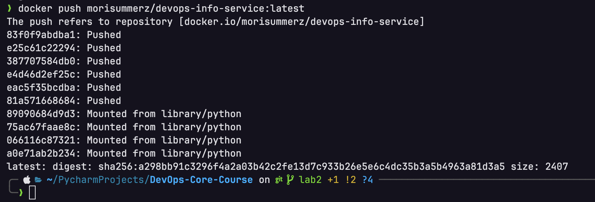

# Lab 2 - Docker Containerization

## Table of Contents

- [Docker Best Practices Applied](#docker-best-practices-applied)
- [Image Information & Decisions](#image-information--decisions)
- [Build & Run Process](#build--run-process)
- [Technical Analysis](#technical-analysis)
- [Challenges & Solutions](#challenges--solutions)

## Docker Best Practices Applied

### 1. Non-Root User

**Implementation:**
```dockerfile
RUN groupadd --gid 1000 appgroup && \
    useradd --uid 1000 --gid 1000 --create-home --shell /bin/bash appuser
# ... later in Dockerfile
USER appuser
```

**Why it matters:**
- **Security:** Running as root inside a container means if an attacker exploits the application, they have root privileges within the container and potentially on the host if there's a container escape vulnerability.
- **Principle of least privilege:** The application doesn't need root permissions to serve HTTP requests, so it shouldn't have them.
- **Production requirement:** Many container orchestration platforms (Kubernetes with PodSecurityPolicies/Standards) reject containers that run as root.

### 2. Specific Base Image Version

**Implementation:**
```dockerfile
FROM python:3.12-slim
```

**Why it matters:**
- **Reproducibility:** Using `python:latest` or just `python` means builds may break unexpectedly when a new Python version is released.
- **Security auditing:** Pinned versions allow tracking which vulnerabilities affect your images.
- **Slim variant:** The `-slim` variant is ~150MB smaller than the full image, reducing attack surface and pull times while still including necessary system libraries.

### 3. Layer Caching Optimization

**Implementation:**
```dockerfile
# Copy requirements FIRST
COPY requirements.txt .
RUN pip install --no-cache-dir -r requirements.txt

# Copy application code AFTER (exclusions handled by .dockerignore)
COPY . .
```

**Why it matters:**
- **Build speed:** Dependencies change less frequently than application code. By copying and installing requirements first, Docker can cache this layer.
- **CI/CD efficiency:** In a typical development cycle, only code changes. With proper layer ordering, rebuilds only re-execute from the COPY code step, skipping the slow `pip install`.
- **Bandwidth savings:** Cached layers don't need to be re-downloaded or re-uploaded.
- **Maintainability:** Using `COPY . .` with `.dockerignore` is easier to maintain than listing individual files - new source files are automatically included.

### 4. .dockerignore File

**Implementation:** Created `.dockerignore` to exclude:
- Virtual environments (`.venv/`, `venv/`)
- Python cache (`__pycache__/`, `*.pyc`)
- IDE files (`.idea/`, `.vscode/`)
- Test files and documentation
- Environment files with secrets (`.env`)
- Git directory (`.git/`)

**Why it matters:**
- **Build context size:** Docker sends the entire build context to the daemon. A `.venv` directory can be 100MB+, slowing builds significantly.
- **Security:** Prevents accidentally including `.env` files with secrets in the image.
- **Image size:** Ensures only necessary files end up in the final image.
- **Build speed:** Smaller context = faster transfer to Docker daemon.

### 5. No Cache for pip

**Implementation:**
```dockerfile
RUN pip install --no-cache-dir -r requirements.txt
```

**Why it matters:**
- **Image size:** pip's cache is useless in a container (you won't run pip install again) but takes up space.
- Typically saves 10-50MB depending on dependencies.

### 6. Environment Variables for Python

**Implementation:**
```dockerfile
ENV PYTHONDONTWRITEBYTECODE=1
ENV PYTHONUNBUFFERED=1
```

**Why it matters:**
- `PYTHONDONTWRITEBYTECODE=1`: Prevents `.pyc` files, keeping the container clean.
- `PYTHONUNBUFFERED=1`: Ensures logs appear immediately in `docker logs` instead of being buffered, critical for debugging.

## Image Information & Decisions

### Base Image Choice

| Option | Size | Pros | Cons |
|--------|------|------|------|
| `python:3.12` | ~1GB | All tools included | Huge, slow pulls |
| `python:3.12-slim` | ~150MB | Good balance | Missing some tools |
| `python:3.12-alpine` | ~50MB | Smallest | musl libc issues, slower builds |

**Decision:** `python:3.12-slim`
- Provides significant size reduction over full image
- Uses glibc (same as most Linux systems), ensuring compatibility
- Includes enough system libraries for most Python packages
- No compilation issues that alpine often has with packages requiring C extensions

### Final Image Size

```bash
# Check image size after build
docker images devops-info-service
```

Expected size: ~180-200MB (base ~150MB + dependencies + app code)

### Layer Structure

```
Layer 1: python:3.12-slim base image (~150MB)
Layer 2: User creation (~1KB)
Layer 3: requirements.txt copy (~1KB)
Layer 4: pip install dependencies (~30-50MB)
Layer 5: Application code copy (~10KB)
Layer 6: Ownership change (~1KB)
```

## Build & Run Process

### Building the Image

```bash
cd app_python
docker build -t devops-info-service:latest .
```

**Expected output:**
```
[+] Building X.Xs (X/X) FINISHED
 => [internal] load build definition from Dockerfile
 => [internal] load .dockerignore
 => [internal] load metadata for docker.io/library/python:3.12-slim
 => [1/7] FROM docker.io/library/python:3.12-slim@sha256:...
 => [2/7] RUN groupadd --gid 1000 appgroup && useradd ...
 => [3/7] WORKDIR /app
 => [4/7] COPY requirements.txt .
 => [5/7] RUN pip install --no-cache-dir -r requirements.txt
 => [6/7] COPY app.py config.py lifespan.py ...
 => [7/7] RUN chown -R appuser:appgroup /app
 => exporting to image
```

### Running the Container

```bash
docker run -d -p 5000:5000 --name devops-service devops-info-service:latest
```

### Testing the Endpoints

```bash
# Test root endpoint
curl http://localhost:5000/

# Test health endpoint
curl http://localhost:5000/health
```

**Expected responses:**

Root endpoint (`/`):
```json
{
  "service": "devops-info-service",
  "version": "1.0.0",
  ...
}
```

Health endpoint (`/health`):
```json
{
  "status": "healthy",
  ...
}
```

### Verifying Non-Root User

```bash
docker exec devops-service whoami
```

**Expected output:** `appuser`

### Docker Hub

**Repository URL:** `https://hub.docker.com/repository/docker/morisummerz/devops-info-service`

**Tagging Strategy:**
- `latest` - most recent stable build
- `v1.0.0` - semantic versioning for releases
- `lab2` - lab-specific tag

**Push commands:**
```bash
docker tag devops-info-service:latest morisummerz/devops-info-service:latest
docker push morisummerz/devops-info-service:latest
```


## Technical Analysis

### Why Does the Dockerfile Work This Way?

1. **FROM as foundation:** Every Dockerfile starts with a base image. We chose `python:3.12-slim` because our app needs Python runtime.

2. **ENV before RUN:** Environment variables are set early so they're available for all subsequent commands and at runtime.

3. **User creation before WORKDIR:** We create the user as root (the default), then later switch to it. Can't create users as non-root.

4. **WORKDIR creates directory:** `WORKDIR /app` creates the directory if it doesn't exist and sets it as the current directory for subsequent commands.

5. **Requirements before code:** This is the key optimization. Docker layer caching means if requirements.txt hasn't changed, the `pip install` layer is reused.

6. **COPY before USER:** We copy files as root, change ownership, then switch to non-root. The non-root user needs permission to read the files.

7. **EXPOSE is documentation:** It doesn't actually publish the port; that's done with `-p` flag at runtime. But it documents what port the app uses.

8. **CMD vs ENTRYPOINT:** We use CMD because it's simple and allows overriding the command easily for debugging (`docker run ... /bin/bash`).

### What Would Happen If Layer Order Changed?

**Bad ordering example:**
```dockerfile
COPY . .  # Copy ALL files first
RUN pip install -r requirements.txt
```

**Problems:**
- Any code change invalidates the pip install cache
- Every build reinstalls all dependencies
- Build times increase from seconds to minutes
- CI/CD pipelines slow down significantly

### Security Considerations

1. **Non-root user:** Primary security measure. Limits blast radius of exploits.

2. **Slim base image:** Fewer packages = fewer potential vulnerabilities.

3. **No secrets in image:** `.env` excluded via `.dockerignore`. Secrets should be injected at runtime via environment variables or secrets management.

4. **Specific versions:** Pinned Python version allows vulnerability scanning and controlled updates.

5. **No unnecessary tools:** Slim image doesn't include compilers, editors, etc., that could be used by attackers.

### How .dockerignore Improves Build

Without `.dockerignore`:
```bash
# Build context might include:
# - .venv/ (~100-500MB)
# - .git/ (~10-50MB)
# - __pycache__/ (~1-5MB)
# Total context: potentially 500MB+
```

With `.dockerignore`:
```bash
# Build context includes only:
# - *.py files
# - requirements.txt
# Total context: ~50KB
```

**Impact:**
- Build context transfer: 500MB → 50KB (10,000x reduction)
- Build start time: seconds → milliseconds
- Prevents accidental secret leakage

## Challenges & Solutions

### Challenge 1: Permission Denied Errors

**Problem:** Initially, the application couldn't read files when running as non-root user.

**Cause:** Files were copied as root but the non-root user didn't have read permissions.

**Solution:** Added `chown -R appuser:appgroup /app` after copying files but before switching to the non-root user.

### Challenge 2: Application Not Receiving Signals

**Problem:** `docker stop` took 10 seconds (timeout) instead of stopping gracefully.

**Cause:** Using shell form of CMD (`CMD python app.py`) wraps the command in a shell, which doesn't forward signals.

**Solution:** Using exec form (`CMD ["python", "app.py"]`) runs Python directly as PID 1, receiving signals properly.

### Challenge 3: Large Build Context

**Problem:** Initial builds were slow despite small application code.

**Cause:** The `.venv` directory was being sent to the Docker daemon.

**Solution:** Created comprehensive `.dockerignore` file excluding virtual environments and other unnecessary files.

### Challenge 4: Cache Invalidation on Code Changes

**Problem:** Every code change triggered a full dependency reinstall.

**Cause:** Single `COPY . .` command before `pip install`.

**Solution:** Split COPY into two steps - requirements first, then code - to leverage layer caching.

### Lessons Learned

1. **Layer ordering matters significantly** for build performance.
2. **Non-root is non-negotiable** for production containers.
3. **`.dockerignore` is as important as `.gitignore`** for efficient builds.
4. **Slim images offer the best balance** between size and compatibility.
5. **Always test the container** behaves the same as local development.
