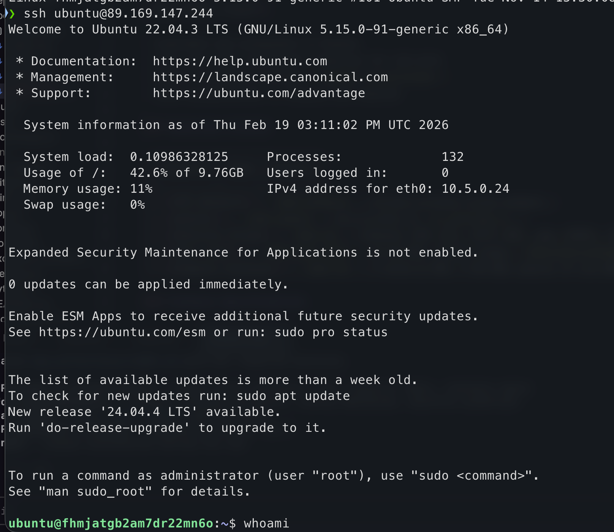
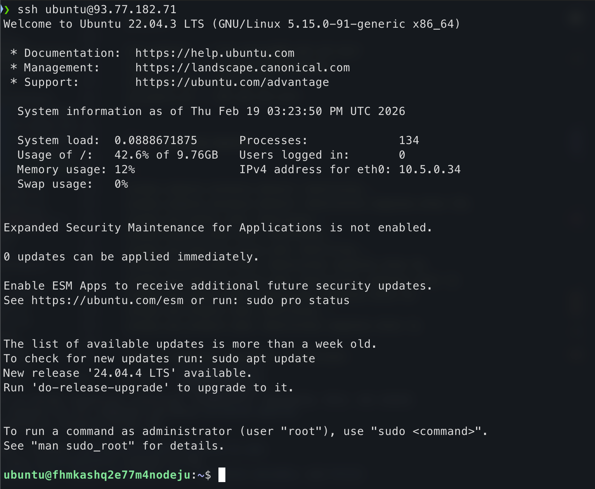

# Lab 4 - Infrastructure as Code (Terraform & Pulumi)

## 1. Cloud Provider & Infrastructure

### Cloud Provider: Yandex Cloud

**Why Yandex Cloud?**

- Available and accessible in Russia
- Free tier with sufficient resources for lab work
- Native Terraform provider (`yandex-cloud/yandex`) and Pulumi provider (`pulumi-yandex`)
- Good documentation in Russian and English

### Resources Created (identical for both tools)

| Resource | Name | Details |
|----------|------|---------|
| **VPC Network** | `lab4-network` | Virtual private cloud network |
| **Subnet** | `lab4-subnet` | 10.5.0.0/24 in `ru-central1-a` |
| **Security Group** | `lab4-sg` | Inbound: SSH (22), HTTP (80), App (5000); Outbound: all |
| **Boot Disk** | `lab4-boot-disk` | 10 GB HDD, Ubuntu image (`fd8s4a9mnca2bmgol2r8`) |
| **Compute Instance** | `lab4-vm` | 2 cores @ 20%, 2 GB RAM, public IP via NAT |

### Instance Specifications

- **Platform:** standard-v3
- **Zone:** ru-central1-a
- **Cores:** 2 (core_fraction = 20%)
- **Memory:** 2 GB
- **Disk:** 10 GB network-HDD
- **OS:** Ubuntu (image `fd8s4a9mnca2bmgol2r8`)
- **Cost:** Free tier eligible

## 2. Terraform Implementation

### Terraform Version

- Terraform CLI v1.x
- Yandex Cloud provider v0.187.0

### Project Structure

```
terraform/
├── .gitignore           # Excludes state, credentials, tfvars
├── main.tf              # Provider config, network, security group, disk, VM
├── variables.tf         # Input variables with defaults and descriptions
├── outputs.tf           # Public IP, private IP, VM ID, SSH command
├── terraform.tfvars     # Actual variable values (gitignored)
└── sa.json              # Service account key (gitignored)
```

### Key Configuration Decisions

- **Variables for all configurable values:** cloud_id, folder_id, zone, VM specs, SSH key path, subnet CIDR — making the config reusable and portable
- **Outputs for essential info:** public IP and SSH command displayed after apply for quick access
- **Security group with least privilege:** only ports 22, 80, 5000 open inbound; all outbound allowed
- **NAT enabled on network interface:** provides a public IP without a separate static IP resource
- **Labels applied to VM:** `project=devops-course`, `lab=lab4` for resource identification
- **Separate boot disk resource:** explicit control over disk size, type, and image

### Security Practices

- Service account key (`sa.json`) is gitignored
- `terraform.tfvars` with cloud IDs is gitignored
- State files (`*.tfstate`) are gitignored
- `.terraform/` directory is gitignored
- No credentials hardcoded in `.tf` files — provider reads from `sa.json` file
- SSH public key injected via `metadata` block

### Terminal Output

#### `terraform init`

```
Initializing the backend...
Initializing provider plugins...
- Reusing previous version of yandex-cloud/yandex from the dependency lock file
- Using previously-installed yandex-cloud/yandex v0.187.0

Terraform has been successfully initialized!
```

#### `terraform plan`

```
Plan: 5 to add, 0 to change, 0 to destroy.

Changes to Outputs:
  + ssh_command   = (known after apply)
  + vm_id         = (known after apply)
  + vm_private_ip = (known after apply)
  + vm_public_ip  = (known after apply)
```

Resources planned:
1. `yandex_vpc_network.lab4` — VPC network
2. `yandex_vpc_subnet.lab4` — Subnet (10.5.0.0/24)
3. `yandex_vpc_security_group.lab4` — Firewall rules (SSH, HTTP, 5000)
4. `yandex_compute_disk.boot` — 10 GB boot disk with Ubuntu image
5. `yandex_compute_instance.default` — VM (2 cores @ 20%, 2 GB RAM)

#### `terraform apply`

```
yandex_vpc_network.lab4: Creating...
yandex_compute_disk.boot: Creating...
yandex_vpc_network.lab4: Creation complete after 3s
yandex_vpc_subnet.lab4: Creating...
yandex_vpc_security_group.lab4: Creating...
yandex_vpc_subnet.lab4: Creation complete after 1s
yandex_vpc_security_group.lab4: Creation complete after 3s
yandex_compute_disk.boot: Creation complete after 8s
yandex_compute_instance.default: Creating...
yandex_compute_instance.default: Creation complete after 39s

Apply complete! Resources: 5 added, 0 changed, 0 destroyed.

Outputs:

ssh_command   = "ssh ubuntu@89.169.147.244"
vm_id         = "fhmjatgb2am7dr22mn6o"
vm_private_ip = "10.5.0.24"
vm_public_ip  = "89.169.147.244"
```

#### `terraform destroy`

```
yandex_compute_instance.default: Destroying...
yandex_compute_instance.default: Destruction complete after 32s
yandex_vpc_subnet.lab4: Destroying...
yandex_compute_disk.boot: Destroying...
yandex_vpc_security_group.lab4: Destroying...
yandex_compute_disk.boot: Destruction complete after 0s
yandex_vpc_security_group.lab4: Destruction complete after 1s
yandex_vpc_subnet.lab4: Destruction complete after 5s
yandex_vpc_network.lab4: Destroying...
yandex_vpc_network.lab4: Destruction complete after 1s

Destroy complete! Resources: 5 destroyed.
```

#### SSH Connection Proof

```bash
$ ssh ubuntu@89.169.147.244 "hostname && uname -a"
fhmjatgb2am7dr22mn6o
Linux fhmjatgb2am7dr22mn6o 5.15.0-91-generic #101-Ubuntu SMP Tue Nov 14 13:30:08 UTC 2023 x86_64 x86_64 x86_64 GNU/Linux
```



## 3. Pulumi Implementation

### Pulumi Version & Language

- Pulumi CLI v3.222.0
- Language: Python 3.12
- Provider: `pulumi-yandex` v0.13.0
- Backend: local file-based state (`state/` directory, gitignored)

### Project Structure

```
pulumi/
├── .gitignore           # Excludes venv, state, stack config
├── __main__.py          # Main infrastructure code
├── requirements.txt     # Python dependencies (pulumi, pulumi-yandex)
├── Pulumi.yaml          # Project metadata
├── Pulumi.dev.yaml      # Stack configuration (gitignored)
├── venv/                # Python virtual environment (gitignored)
└── state/               # Local Pulumi state (gitignored)
```

### How Code Differs from Terraform

**Terraform (HCL — declarative):**
```hcl
resource "yandex_vpc_security_group" "lab4" {
  name       = "lab4-sg"
  network_id = yandex_vpc_network.lab4.id

  ingress {
    description    = "Allow SSH"
    protocol       = "TCP"
    port           = 22
    v4_cidr_blocks = ["0.0.0.0/0"]
  }
}
```

**Pulumi (Python — imperative):**
```python
security_group = yandex.VpcSecurityGroup(
    "lab4-sg",
    name="lab4-sg",
    network_id=network.id,
    ingresses=[
        yandex.VpcSecurityGroupIngressArgs(
            description="Allow SSH",
            protocol="TCP",
            port=22,
            v4_cidr_blocks=["0.0.0.0/0"],
        ),
    ],
)
```

### Terminal Output

#### `pulumi preview`

```
Previewing update (dev):
 +  pulumi:pulumi:Stack lab4-infra-dev create
 +  yandex:index:ComputeDisk lab4-boot-disk create
 +  yandex:index:VpcNetwork lab4-network create
 +  yandex:index:VpcSubnet lab4-subnet create
 +  yandex:index:VpcSecurityGroup lab4-sg create
 +  yandex:index:ComputeInstance lab4-vm create

Resources:
    + 6 to create
```

#### `pulumi up`

```
Updating (dev):
 +  pulumi:pulumi:Stack lab4-infra-dev creating
 +  yandex:index:ComputeDisk lab4-boot-disk creating
 +  yandex:index:VpcNetwork lab4-network creating
 +  yandex:index:VpcNetwork lab4-network created (2s)
 +  yandex:index:VpcSubnet lab4-subnet created (0.47s)
 +  yandex:index:VpcSecurityGroup lab4-sg created (2s)
 +  yandex:index:ComputeDisk lab4-boot-disk created (6s)
 +  yandex:index:ComputeInstance lab4-vm created (119s)
 +  pulumi:pulumi:Stack lab4-infra-dev created (126s)

Outputs:
    ssh_command  : "ssh ubuntu@93.77.182.71"
    vm_id        : "fhmkashq2e77m4nodeju"
    vm_private_ip: "10.5.0.34"
    vm_public_ip : "93.77.182.71"

Resources:
    + 6 created

Duration: 2m7s
```

#### SSH Connection Proof

```bash
$ ssh ubuntu@93.77.182.71 "hostname && uname -a"
fhmkashq2e77m4nodeju
Linux fhmkashq2e77m4nodeju 5.15.0-91-generic #101-Ubuntu SMP Tue Nov 14 13:30:08 UTC 2023 x86_64 x86_64 x86_64 GNU/Linux
```


## 4. Terraform vs Pulumi Comparison

### Ease of Learning

Terraform was easier to learn for this task. HCL has a simple, purpose-built syntax with clear block structure — provider, resource, variable, output. Pulumi requires knowing both the Pulumi SDK concepts and a general-purpose language. For a small project like this, HCL's simplicity is an advantage.

### Code Readability

Terraform's HCL is more readable for infrastructure definitions. The declarative blocks are self-documenting and easy to scan. Pulumi's Python code is more verbose due to argument class constructors (`VpcSecurityGroupIngressArgs(...)`) but benefits from IDE autocompletion and type checking.

### Debugging

Terraform was easier to debug. Errors in `terraform plan` clearly point to the problematic resource and attribute. Pulumi errors can be obscured by Python tracebacks and provider plugin issues (e.g., the `pkg_resources` deprecation issue required downgrading `setuptools`).

### Documentation

Terraform has significantly better documentation. The Terraform Registry has comprehensive examples for every resource. Pulumi's Yandex Cloud provider documentation is sparse, and the SDK is less actively maintained than the Terraform provider.

### Use Case

**Use Terraform when:** infrastructure is straightforward, team includes non-developers, you need the widest community support and provider coverage.
**Use Pulumi when:** you need complex logic (loops, conditionals, dynamic resource generation), you prefer native testing, or your team is already comfortable with Python/TypeScript.

## 5. Bonus: IaC CI/CD

### GitHub Actions Workflow

Created `.github/workflows/terraform-ci.yml` that triggers on PRs modifying `terraform/**` files.

**Workflow steps:**
1. **Checkout** — clone the repository
2. **Setup Terraform** — install Terraform v1.9.0
3. **Format Check** — `terraform fmt -check -recursive` ensures consistent code style
4. **Init** — `terraform init -backend=false` initializes providers without backend state
5. **Validate** — `terraform validate` checks syntax and configuration validity
6. **Setup TFLint** — installs the latest TFLint version
7. **Run TFLint** — lints Terraform code for best practices and common errors

**Path filtering:** the workflow only runs when files in `terraform/` or the workflow file itself change, avoiding unnecessary CI runs for unrelated changes.

## 6. Lab 5 Preparation & Cleanup

### VM for Lab 5

- **Keeping VM for Lab 5:** Yes
- **Which VM:** Pulumi-created VM at `93.77.182.71`
- The VM has SSH access configured and ports 22, 80, 5000 open — ready for Ansible provisioning in Lab 5

### Cleanup Status

- Terraform resources were destroyed (`terraform destroy` — see output above)
- Pulumi VM is running and accessible via SSH
- Infrastructure can be destroyed with `pulumi destroy` and recreated at any time

## 7. Challenges

- **Boot disk image ID:** Needed to find a valid Ubuntu image ID for the Yandex Cloud `ru-central1-a` zone
- **SSH connectivity timing:** VMs needed ~20 seconds after creation before SSH was available
- **Security group configuration:** Yandex Cloud uses `port` for single-port rules and `from_port`/`to_port` for ranges, different from AWS-style security groups
- **Pulumi `pkg_resources` error:** The `pulumi-yandex` SDK depends on the deprecated `pkg_resources` module; required pinning `setuptools<82` to resolve
- **Pulumi local backend:** Needed to configure `PULUMI_BACKEND_URL` and `PULUMI_CONFIG_PASSPHRASE` environment variables for file-based state without Pulumi Cloud
