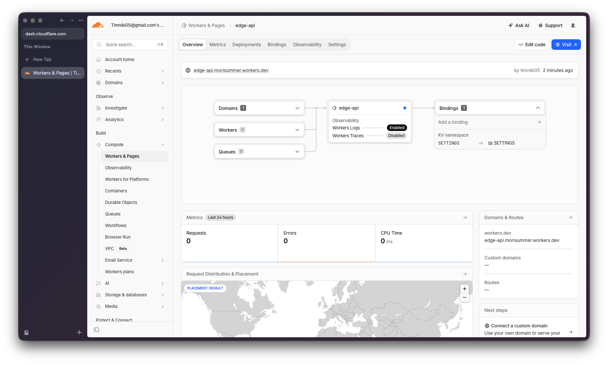
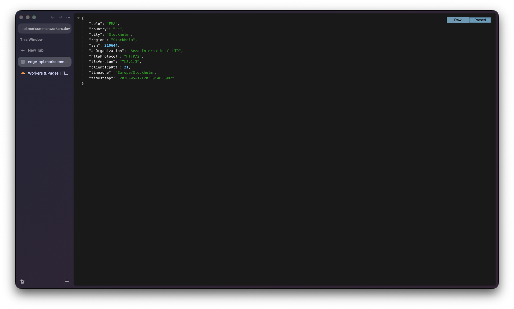
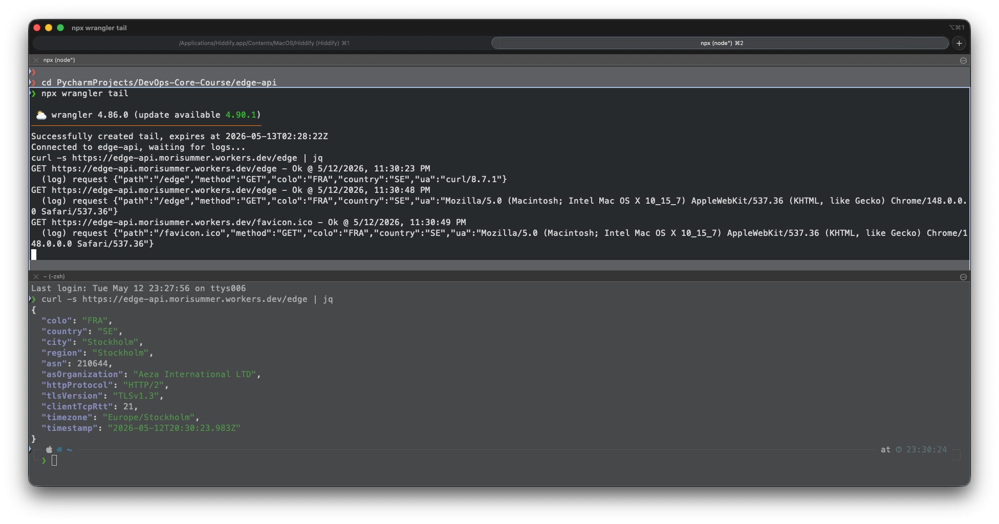
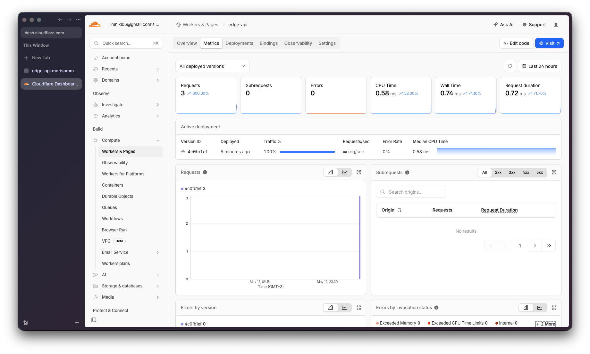

# Lab 17 — Cloudflare Workers Edge Deployment

This document covers the deployment of `edge-api`, a serverless HTTP API
running on Cloudflare's global edge network for DevOps Core Course Lab 17.

---

## 1. Deployment Summary

| Item               | Value                                        |
|--------------------|----------------------------------------------|
| Worker name        | `edge-api`                                   |
| Public URL         | `https://edge-api.morisummer.workers.dev`    |
| Runtime            | Cloudflare Workers (V8 isolates, not Docker) |
| Source language    | TypeScript                                   |
| Configuration file | [`wrangler.jsonc`](./wrangler.jsonc)         |
| Compatibility date | `2026-05-01`                                 |
| Source code        | [`src/index.ts`](./src/index.ts)             |

### Routes

| Method | Path       | Description                                                                                                                     |
|--------|------------|---------------------------------------------------------------------------------------------------------------------------------|
| `GET`  | `/`        | App metadata: name, course, environment, version, list of endpoints                                                             |
| `GET`  | `/health`  | Liveness check: returns `{"status":"ok", ...}`                                                                                  |
| `GET`  | `/edge`    | Edge metadata: `colo`, `country`, `city`, `asn`, `httpProtocol`, `tlsVersion`, `clientTcpRtt`, etc. — sourced from `request.cf` |
| `GET`  | `/counter` | KV-persisted visit counter; increments `visits` key on each call                                                                |
| `GET`  | `/config`  | Reflects plaintext vars and indicates whether secrets are bound (values are masked)                                             |
| any    | other      | `404 {"error":"Not Found"}`                                                                                                     |

### Configuration

**Plaintext vars** (defined in `wrangler.jsonc`):

| Var           | Value         | Purpose                                                  |
|---------------|---------------|----------------------------------------------------------|
| `APP_NAME`    | `edge-api`    | Identifies the app in responses                          |
| `COURSE_NAME` | `devops-core` | Identifies the course                                    |
| `ENVIRONMENT` | `production`  | Distinguishes deploys; can be overridden per environment |

> **Why plaintext vars are not suitable for secrets:** the file
> `wrangler.jsonc` is committed to the Git repository in plain text. Any
> value in `vars` is exposed to anyone who reads the repo and is also
> downloadable via the Cloudflare dashboard without any access control on
> the value itself. Plaintext vars are appropriate only for non-sensitive
> configuration (names, environment labels, public flags). Secrets must
> live in an encrypted store — Workers Secrets — which is what we use for
> `API_TOKEN` and `ADMIN_EMAIL`.

**Secrets** (set with `wrangler secret put`, never committed):

| Secret        | How it's set                          | Used by                                |
|---------------|---------------------------------------|----------------------------------------|
| `API_TOKEN`   | `npx wrangler secret put API_TOKEN`   | `/config` (presence + length only)     |
| `ADMIN_EMAIL` | `npx wrangler secret put ADMIN_EMAIL` | `/config` (masked: `a***@example.com`) |

For local `wrangler dev`, the same values are loaded from `.dev.vars`
(gitignored). An example template is in `.dev.vars.example`.

**KV namespace:**

| Binding    | Variable       | Purpose                                                    |
|------------|----------------|------------------------------------------------------------|
| `SETTINGS` | `env.SETTINGS` | Persists the `visits` counter at the edge across redeploys |

---

## 2. Evidence

### 2.1 Cloudflare dashboard

> Workers & Pages → `edge-api`



### 2.2 `/edge` JSON response

Captured by running:

```bash
curl -s https://edge-api.morisummer.workers.dev/edge | jq
```

Example response (filled in from a real call against the deployed Worker):

```json
{
  "colo": "FRA",
  "country": "SE",
  "city": "Stockholm",
  "region": "Stockholm",
  "asn": 210644,
  "asOrganization": "Aeza International LTD",
  "httpProtocol": "HTTP/2",
  "tlsVersion": "TLSv1.3",
  "clientTcpRtt": 21,
  "timezone": "Europe/Stockholm",
  "timestamp": "2026-05-12T20:30:23.983Z"
}
```



### 2.3 Logs

Captured with `npx wrangler tail` while curling the deployed Worker:

```text
GET https://edge-api.morisummer.workers.dev/favicon.ico - Ok @ 5/12/2026, 11:30:49 PM
  (log) request {"path":"/favicon.ico","method":"GET","colo":"FRA","country":"SE","ua":"Mozilla/5.0 (Macintosh; Intel Mac OS X 10_15_7) AppleWebKit/537.36 (KHTML, like Gecko) Chrome/148.0.0.0 Safari/537.36"}
```



### 2.4 Metrics

Reviewed in the dashboard: `Workers & Pages → edge-api → Metrics`.

Metric reviewed: **Requests** (total request count over the last hour).
Also visible: Subrequests, Errors, CPU time, Wall time, and Median execution
duration. Wall time is a good operational metric because Workers are billed
on CPU time but constrained on wall time per request.



### 2.5 Persistence verified after redeploy

```bash
# Hit /counter several times to seed the value
curl https://edge-api.morisummer.workers.dev/counter
curl https://edge-api.morisummer.workers.dev/counter
curl https://edge-api.morisummer.workers.dev/counter   # -> {"visits": 3, ...}

# Redeploy
npx wrangler deploy

# Counter survives the redeploy because KV is independent of Worker version
curl https://edge-api.morisummer.workers.dev/counter   # -> {"visits": 4, ...}
```

The fact that `/counter` returns `visits: 4` (not `1`) after a fresh deploy
proves that the value lives in Workers KV, not in Worker memory — Worker
isolates are stateless and discarded between requests.

### 2.6 Deployment history & rollback

```bash
$ npx wrangler deployments list
Created:     2026-05-12T20:25:43.574Z
Author:      timniki05@gmail.com
Source:      Upload
Message:     Automatic deployment on upload.
Version(s):  (100%) f8022294-632a-4b58-8513-ca071b1d9b61
                 Created:  2026-05-12T20:25:43.574Z
                     Tag:  -
                 Message:  -

Created:     2026-05-12T20:25:46.083Z
Author:      timniki05@gmail.com
Source:      Secret Change
Message:     -
Version(s):  (100%) bb74742b-c16f-49f8-82d9-9f544d112bd5
                 Created:  2026-05-12T20:25:46.083Z
                     Tag:  -
                 Message:  -

Created:     2026-05-12T20:26:08.397Z
Author:      timniki05@gmail.com
Source:      Secret Change
Message:     -
Version(s):  (100%) 48e1529b-2f63-47c8-8c9e-16e8eae908a9
                 Created:  2026-05-12T20:26:08.397Z
                     Tag:  -
                 Message:  -

Created:     2026-05-12T20:26:25.243Z
Author:      timniki05@gmail.com
Source:      Unknown (deployment)
Message:     -
Version(s):  (100%) 31a79a1a-6354-4742-849e-d320f3cd5330
                 Created:  2026-05-12T20:26:22.911Z
                     Tag:  -
                 Message:  -

Created:     2026-05-12T20:27:23.891Z
Author:      timniki05@gmail.com
Source:      Unknown (deployment)
Message:     -
Version(s):  (100%) 4c0fb1ef-a4b8-41e7-980f-a60871cbdc78
                 Created:  2026-05-12T20:27:21.317Z
                     Tag:  -
                 Message:  -
```

A rollback was performed with:

```bash
npx wrangler rollback 31a79a1a-6354-4742-849e-d320f3cd5330
```

This re-points 100% of traffic to the previous Worker version. Importantly,
**KV state was not rolled back** — only the Worker code changed. This is the
opposite of a stateful PVC-rollback in Kubernetes, where state and code
sometimes have to be migrated together.

---

## 3. Kubernetes vs Cloudflare Workers

| Aspect                    | Kubernetes                                                                                                | Cloudflare Workers                                                                                                                                                                       |
|---------------------------|-----------------------------------------------------------------------------------------------------------|------------------------------------------------------------------------------------------------------------------------------------------------------------------------------------------|
| **Setup complexity**      | High: cluster, nodes, RBAC, ingress, registry, observability stack all required before first deploy       | Very low: `npm create cloudflare`, `wrangler login`, `wrangler deploy`                                                                                                                   |
| **Deployment speed**      | Build image → push to registry → roll out → wait for pods ready (minutes)                                 | `wrangler deploy` pushes a JS bundle in seconds; global propagation in tens of seconds                                                                                                   |
| **Global distribution**   | Manual: clusters per region, multi-cluster ingress, geo-DNS, replicated databases                         | Automatic: every Worker runs in ~300 Cloudflare locations; no region selection                                                                                                           |
| **Cost (small apps)**     | Pays for nodes 24/7 even at zero traffic; LBs and PVs add baseline cost                                   | Free tier: 100k requests/day; paid: $5/mo for 10M; pay-per-request beyond that                                                                                                           |
| **State / persistence**   | Built around stateful pods, PVCs, StatefulSets, sidecars; full DB engines supported                       | No local disk, no long-lived processes. State lives in bindings: KV (eventually consistent, slow writes), Durable Objects (strong consistency), R2 (object storage), D1 (SQLite), Queues |
| **Control / flexibility** | Anything that runs in a Linux container runs in K8s — any language, runtime, system call, binary protocol | Limited to the Workers runtime (JS/TS, Python, Rust→Wasm). No native binaries. Per-request CPU/wall limits. No raw TCP listeners                                                         |
| **Best use case**         | Long-running, stateful, or compute-heavy services; legacy containers; complex topologies                  | Globally-distributed HTTP APIs, edge middleware (auth, A/B, geo-routing), low-latency JSON APIs, request-time transformations                                                            |

---

## 4. When to use each

### Favor Kubernetes when

- The workload is a **long-running container** with background processes, cron jobs, or persistent in-process state.
- You need **a specific runtime** that doesn't compile to JS/Wasm (JVM with native libraries, .NET with COM interop,
  custom databases).
- You need **raw TCP, UDP, or non-HTTP protocols** (gRPC streaming, MQTT, WebRTC TURN), or you need to bind to arbitrary
  ports.
- You need **strict per-request resource ceilings far above Worker limits** (heavy ML inference, large file processing).
- You already operate a cluster and adding one more service is cheaper than introducing a new platform.

### Favor Cloudflare Workers when

- The workload is a **stateless or KV-shaped HTTP API**: routing, auth, geo-aware responses, JSON transformations,
  caching helpers, webhook receivers.
- **Latency matters globally**: users in 50 countries should each hit a nearby PoP, and you don't want to run clusters
  in 50 regions.
- The team is small and **operational overhead must be near-zero** — no nodes, no patching, no autoscalers to tune.
- Traffic is **spiky or unpredictable**, so paying for idle nodes is wasteful — Workers cold-start in ~1 ms.
- The deployment must **roll back in seconds** with zero risk of stuck pods or failed image pulls.

### Recommendation

For Lab 17's `edge-api` — a small HTTP API that returns JSON, persists a
counter, and exposes config — Workers is the obvious right tool: zero
infrastructure, global by default, free at this volume, deploys in seconds.

In production at the Spredo / DevOps-Core scale, the practical pattern is
**both**:

- **Workers at the edge** for everything that touches user requests
  directly (auth, routing, geo logic, lightweight personalization, rate
  limiting, request validation).
- **Kubernetes in a region** for the heavy origin: the long-running
  application server, the database connection pool, the background worker
  queue, the ML inference service.

Workers and K8s are complementary, not competing — Workers shrinks the part
of the stack that has to live in your cluster, and the cluster keeps the
part that legitimately benefits from running there.

---

## 5. Reflection

**What felt easier than Kubernetes:**

The whole feedback loop. From `npm create cloudflare` to a public HTTPS URL
serving traffic took about three minutes — no Dockerfile, no image
registry, no ingress controller, no cert-manager, no `kubectl apply`,
no `helm install`, no `kubectl rollout status`. The `workers.dev` URL is
issued automatically with a valid TLS cert. Compared to Lab 9 (where a
basic K8s deployment required a Deployment, Service, Ingress, and a working
ingress controller before the first request could reach the app), this was
an order of magnitude less ceremony.

Secrets management is also dramatically simpler. `wrangler secret put`
beats writing a SealedSecret, a SOPS-encrypted ConfigMap, an External
Secrets Operator manifest, or even a plain `kubectl create secret` followed
by a Pod restart.

**What felt more constrained:**

The runtime. There is no `child_process.spawn`, no filesystem, no native
modules, no raw TCP sockets. KV is eventually consistent and rate-limited
on writes, so `/counter` is a toy — in a real app I'd reach for Durable
Objects for strong consistency, which adds back some complexity. CPU time
per request is bounded (50ms on the free plan), so any heavy work has to
be offloaded to another system. The "everything is JavaScript" model is
liberating until you have a library that only exists in Python or only
ships as a native binary — at that point you're back to a container.

**What changed because Workers is not a Docker host:**

I didn't write a Dockerfile and didn't build a multi-platform image. The
artifact uploaded by `wrangler deploy` is a JavaScript bundle plus the
binding metadata — about 3 KiB gzipped versus a multi-hundred-megabyte
container image. There is no concept of "deploy to region X" because the
same bundle runs in every PoP; the question is just "is this PoP in
Cloudflare's network?" The K8s vocabulary of node, pod, deployment,
replicaSet, HPA, PDB, ingress, and PVC collapses into "worker" and
"binding". A lot of Lab 1–16 conceptual surface area becomes either
unnecessary or invisible.

Importantly, **the operational concerns are still real**: routes, health
checks, configuration, state, logs, deployments, rollbacks — every item
from Lab 1's checklist still exists in `edge-api`. They're just much
smaller, because the platform absorbs the parts that aren't application
logic.
