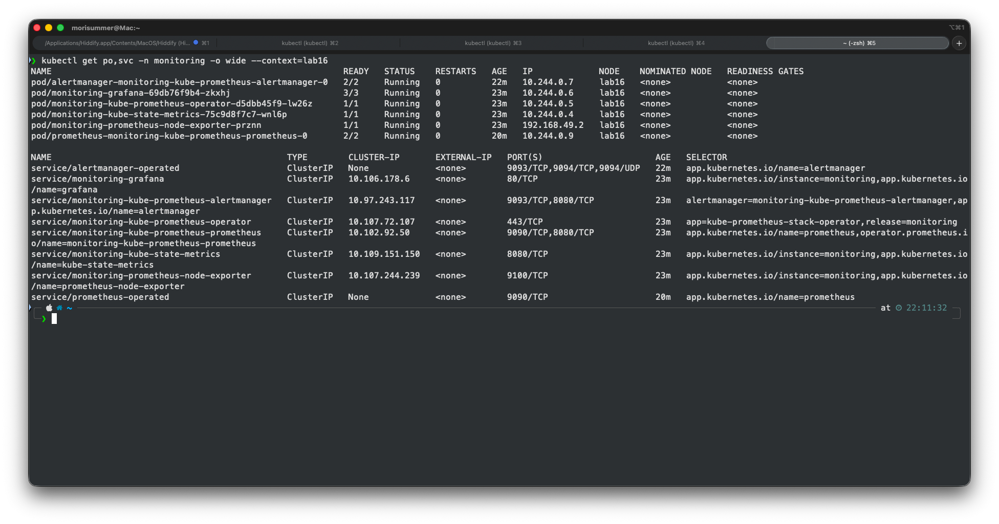
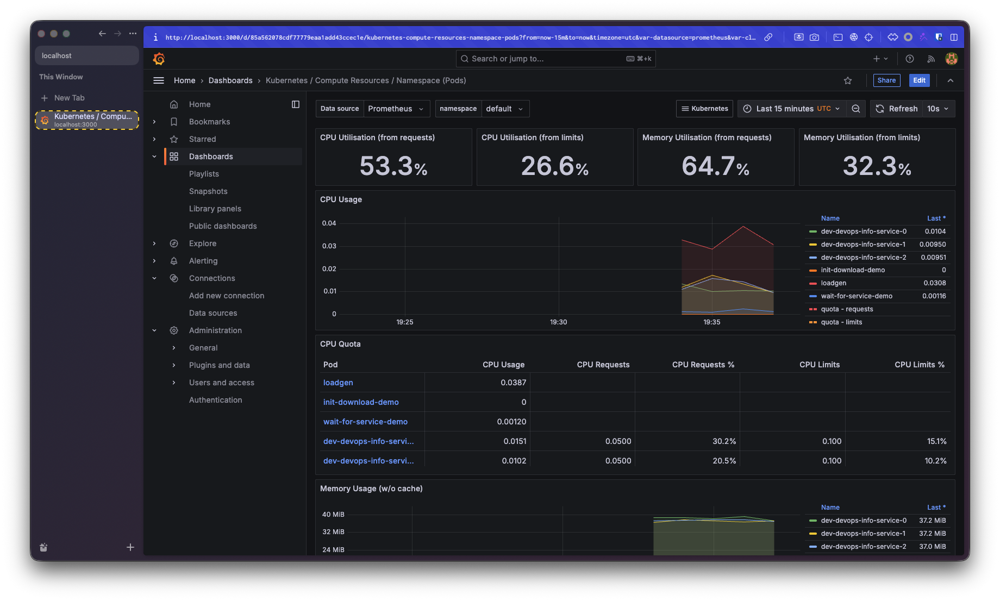
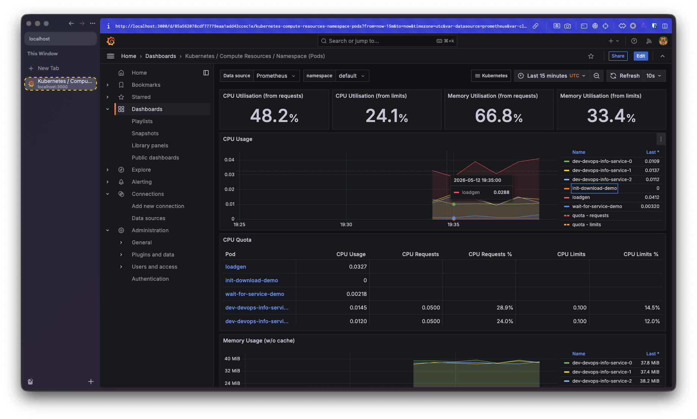
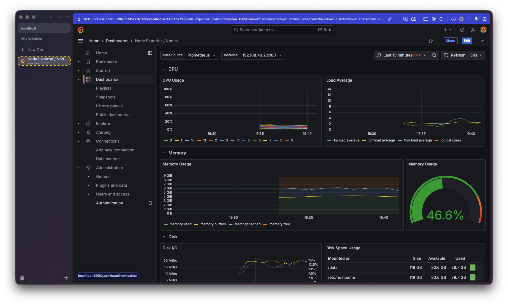
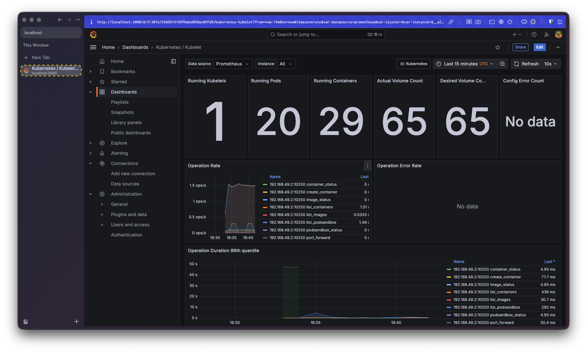
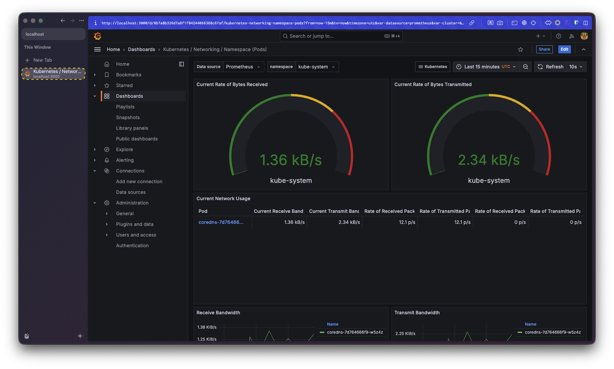
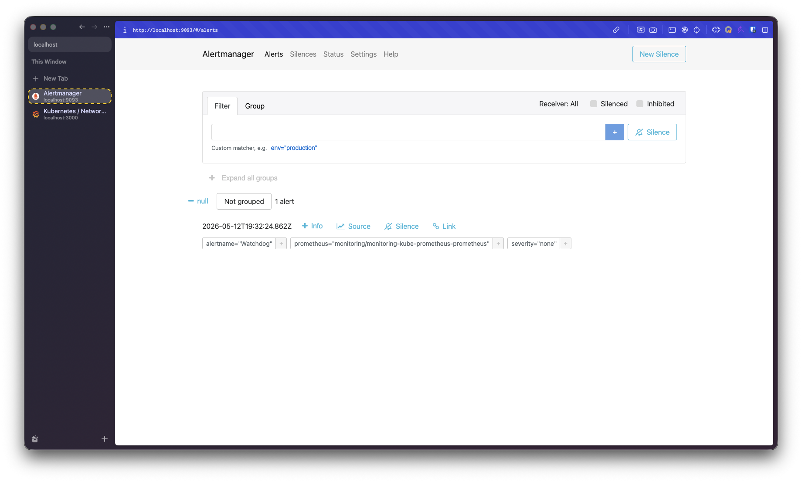
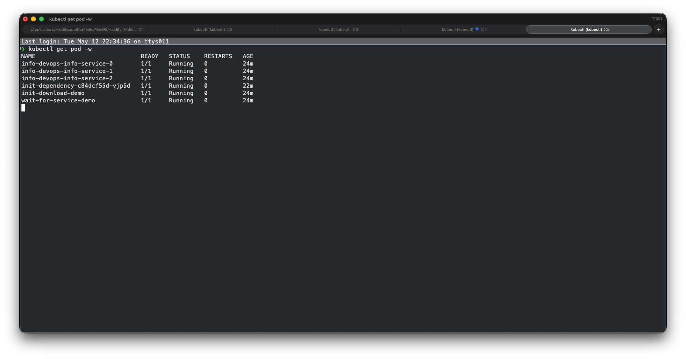
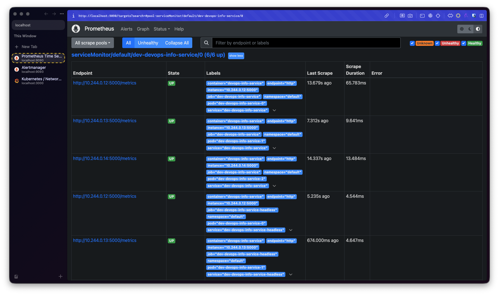

# Cluster Monitoring & Init Containers — Lab 16

This document covers the installation and exploration of the **Kube-Prometheus
stack** on a Minikube cluster, two **init container** patterns layered on top
of the existing `devops-info-service` Helm chart, and the bonus
**ServiceMonitor** that wires the application's `/metrics` endpoint into
Prometheus.

Tested versions: Minikube `v1.34+`, Kubernetes `v1.32+`,
`kube-prometheus-stack` chart `65.x`.

---

## 1. Stack Components

The `kube-prometheus-stack` Helm chart bundles a complete
Prometheus-Operator-managed monitoring system. Each component has a single,
well-defined responsibility:

| Component               | Role                                                                                                                                                                                                                                                                                               |
|-------------------------|----------------------------------------------------------------------------------------------------------------------------------------------------------------------------------------------------------------------------------------------------------------------------------------------------|
| **Prometheus Operator** | Custom-resource controller. Watches `Prometheus`, `Alertmanager`, `ServiceMonitor`, `PodMonitor`, and `PrometheusRule` CRDs and reconciles the underlying StatefulSets and config Secrets. Lets you "configure Prometheus by writing Kubernetes objects" instead of hand-editing `prometheus.yml`. |
| **Prometheus**          | Time-series database and scraper. Pulls `/metrics` endpoints on a fixed interval, evaluates recording and alerting rules, and stores samples locally. Run as a StatefulSet with a PVC.                                                                                                             |
| **Alertmanager**        | Receives alerts fired by Prometheus, deduplicates and groups them, then routes to receivers (email/Slack/PagerDuty/webhook). Handles silences and inhibitions.                                                                                                                                     |
| **Grafana**             | Visualization layer. Comes pre-provisioned with the Prometheus data source and ~30 dashboards covering nodes, namespaces, pods, kubelet, API server, etcd, and CoreDNS.                                                                                                                            |
| **kube-state-metrics**  | Reads the Kubernetes API and exposes the *state* of objects as metrics — `kube_pod_status_phase`, `kube_deployment_spec_replicas`, etc. Distinct from cAdvisor metrics, which describe container resource usage.                                                                                   |
| **node-exporter**       | DaemonSet that exposes host-level metrics (CPU, memory, disk, filesystem, network) from every node's `/proc` and `/sys`. The "Node Exporter / Nodes" dashboard reads from it.                                                                                                                      |

In short: the **Operator** turns CRDs into running Prometheus/Alertmanager
StatefulSets; **Prometheus** pulls from `/metrics` endpoints discovered via
ServiceMonitors; **kube-state-metrics** and **node-exporter** are themselves
two of those scrape targets; **Grafana** queries Prometheus to render
dashboards; **Alertmanager** delivers anything that fires.

---

## 2. Installation Evidence

The stack was installed into a dedicated `monitoring` namespace via the
official chart:

```bash
minikube start --profile=lab16 \
  --driver=docker \
  --container-runtime=containerd \
  --memory=4096 --cpus=2

helm repo add prometheus-community https://prometheus-community.github.io/helm-charts
helm repo update

helm install monitoring prometheus-community/kube-prometheus-stack \
  --namespace monitoring \
  --create-namespace \
  --version 65.8.1 \
  --set kubeEtcd.enabled=false \
  --set kubeControllerManager.enabled=false \
  --set kubeScheduler.enabled=false \
  --set kubeProxy.enabled=false \
  --set prometheus.prometheusSpec.maximumStartupDurationSeconds=60 \
  --wait --timeout 10m
```

Three adjustments are needed for Minikube + this chart version:

- **Use `--container-runtime=containerd`.** With the default `docker`
  runtime on recent Minikube + cgroup v2, cAdvisor only emits **pod-level**
  cgroup metrics — the per-container series (those carrying `container=` and
  `image=` labels) are missing. Every kube-prometheus dashboard query
  filters by `container!=""` and `image!=""`, so without this flag the
  *Compute Resources / Pod* and *Compute Resources / Namespace (Pods)*
  dashboards render only requests/limits lines and "No data" panels.
  Switching the runtime to containerd makes cAdvisor emit the per-container
  cgroups it expects.
- **Disable the four control-plane exporters** (`kubeEtcd`, `kubeControllerManager`,
  `kubeScheduler`, `kubeProxy`). On Minikube these components bind to
  localhost on the control-plane node, so their `/metrics` endpoints are not
  reachable from the in-cluster Prometheus and the corresponding default
  `*Down` alerts fire perpetually. Disabling the exporters removes both the
  scrape targets and the alerts. (As a bonus this sidesteps a known YAML
  parse bug in the etcd ServiceMonitor template in chart `65.5.0`.)
- **Pin `prometheus.prometheusSpec.maximumStartupDurationSeconds=60`.** The
  `Prometheus` CRD validates this field as `>= 60`, but the chart leaves the
  default at `0`, so without an explicit value the operator submits an
  invalid object and the install aborts with
  `spec.maximumStartupDurationSeconds in body should be greater than or equal to 60`.

Because the runtime is containerd, the host docker daemon trick from earlier
labs no longer reaches the node's image store. Build on host docker and load
into the cluster instead:

```bash
docker build -t morisummerz/devops-info-service:latest app_python/
minikube --profile=lab16 image load morisummerz/devops-info-service:latest
```

If a previous `helm install` failed partway through, clear the leftover
`Prometheus`/`Alertmanager` objects before retrying so the new install is
not fighting a stale resource:

```bash
helm uninstall monitoring -n monitoring 2>/dev/null || true
kubectl delete prometheus    -n monitoring --all --ignore-not-found
kubectl delete alertmanager  -n monitoring --all --ignore-not-found
```

After roll-out, the namespace contains the operator, a Prometheus and an
Alertmanager StatefulSet, the Grafana Deployment, kube-state-metrics, the
node-exporter DaemonSet, plus their accompanying Services:



---

## 3. Grafana Dashboard Exploration

Grafana was exposed via `kubectl port-forward` and signed in as
`admin / prom-operator`:

```bash
kubectl port-forward -n monitoring svc/monitoring-grafana 3000:80
```

For each question below, the relevant dashboard, the panel that contains the
answer, and a screenshot placeholder are listed. Replace each `**Answer:**`
line with the value you read off the dashboard (these are environment-
specific so they cannot be filled in here in advance).

### 3.1 Pod Resources — CPU/memory of the StatefulSet

Lab 15 deployed `devops-info-service` as a StatefulSet (`statefulset.enabled=true`)
with three replicas in the `default` namespace.

- **Dashboard:** *Kubernetes / Compute Resources / Pod*
- **Variables:** `namespace=default`, `pod=dev-devops-info-service-0` (then
  also `-1`, `-2`).
- **Panels:** *CPU Usage*, *Memory Usage (WSS)*.



---

### 3.2 Namespace Analysis — top/bottom CPU pods in `default`

- **Dashboard:** *Kubernetes / Compute Resources / Namespace (Pods)*
- **Variable:** `namespace=default`
- **Panel:** *CPU Usage* (table view sorts the per-pod series).



**Answer:**

- Highest CPU pod: `loadgen`
- Lowest CPU pod: `init-download-demo`

---

### 3.3 Node Metrics — memory and CPU on the Minikube node

- **Dashboard:** *Node Exporter / Nodes*
- **Variable:** `instance=<minikube-node-ip>:9100` (only one value on a single-node Minikube).
- **Panels:** *Memory Usage*, *CPU Busy*, *CPU Cores*.



**Answer:**

- Memory used: `46 %` (`4080 MiB` of `7300 MiB`)
- CPU cores: `12`

---

### 3.4 Kubelet — pods and containers managed

- **Dashboard:** *Kubernetes / Kubelet*
- **Variable:** `instance=<minikube-node-ip>:10250`
- **Panels:** *Running Pods*, *Running Containers*.



**Answer:** Running pods = `20`, Running containers = `29`.

---

### 3.5 Network — traffic for pods in `default`

- **Dashboard:** *Kubernetes / Networking / Namespace (Pods)*
- **Variable:** `namespace=default`
- **Panels:** *Current Rate of Bytes Received*, *Current Rate of Bytes Transmitted*.



**Answer:** RX ≈ `1.36 kB/s`, TX ≈ `2.34 kB/s`.

---

### 3.6 Alerts — active alerts

- **UI:** Alertmanager (port-forwarded separately).
- **Grafana:** *Alerting → Alert rules* also lists firing alerts under `kube-prometheus-stack`.

```bash
kubectl port-forward -n monitoring svc/monitoring-kube-prometheus-alertmanager 9093:9093
```



**Answer:** `1` active alerts (`Watchdog`, `KubeSchedulerDown`, …).

---

## 4. Init Containers

Init containers run to completion **before** any of the main containers in a
pod start. They share the pod's volumes and network namespace, which makes
them the natural place to put one-time setup (downloads, config templating,
schema migrations) or readiness gates (waiting for a dependency to come
online).

Two patterns from Lab 16 are demonstrated here.

### 4.1 Download-and-Share

[`k8s/init-containers/pod-init-download.yaml`](init-containers/pod-init-download.yaml)
defines a `Pod` with:

- An **init container** (`busybox:1.36`) that runs
  `wget -qO /work-dir/index.html https://example.com` against an `emptyDir`
  volume mounted at `/work-dir`.
- A **main container** (`nginx:1.27-alpine`) that mounts the *same* emptyDir
  at `/usr/share/nginx/html`.

Because the volume is shared, nginx ends up serving the file the init
container downloaded — no baked-in image, no ConfigMap, just a pre-start
hook.

```bash
kubectl apply -f k8s/init-containers/pod-init-download.yaml

# Watch the init phase complete (Init:0/1 → PodInitializing → Running):
kubectl get pod init-download-demo -w

# Init container logs:
kubectl logs init-download-demo -c init-download

# Prove the main container sees the downloaded file:
kubectl exec init-download-demo -c web -- head -5 /usr/share/nginx/html/index.html

# Or hit nginx itself:
kubectl port-forward pod/init-download-demo 8080:80 &
curl -s http://localhost:8080 | head -5
```



---

### 4.2 Wait-for-Service Gate

[`k8s/init-containers/pod-init-wait.yaml`](init-containers/pod-init-wait.yaml)
demonstrates the canonical "don't start the app until X exists" pattern:

- The init container loops `until nslookup dev-devops-info-service`, sleeping
  2 s between attempts.
- The main container is a `curlimages/curl` shell that hits the dependency
  every 5 s once it's been allowed to start.

The interesting failure mode is what happens when the dependency is *missing*
— the pod sits in `Init:0/1` indefinitely, which is exactly what you want
when the alternative is the main container crash-looping with connection
errors.

**Demo (gate firing):** apply the pod *without* the chart, then install the
chart and watch the gate release.

```bash
# 1) Make sure the target service does NOT exist:
kubectl delete -f k8s/devops-info-service --ignore-not-found  # or `helm uninstall dev`

# 2) Apply the wait pod — it should hang on Init:0/1
kubectl apply -f k8s/init-containers/pod-init-wait.yaml
kubectl get pod wait-for-service-demo -w
# expected: STATUS=Init:0/1 for as long as the service is missing

# 3) Tail the init container to see the polling loop
kubectl logs wait-for-service-demo -c wait-for-service -f

# 4) In another terminal, install the chart so the service appears
helm upgrade --install dev k8s/devops-info-service \
  -f k8s/devops-info-service/values-dev.yaml

# 5) Within a few seconds the init container exits, the main container starts,
#    and curl begins printing health responses.
kubectl logs wait-for-service-demo -c client -f
```

---

## 5. Bonus — Custom Metrics & ServiceMonitor

The application has exposed Prometheus metrics since Lab 8
([`app_python/metrics.py`](../app_python/metrics.py),
[`app_python/app.py:24-27`](../app_python/app.py)) using the
`prometheus-client` library: HTTP RED metrics, in-progress request gauge,
and two domain-specific histograms.

To plug those metrics into the cluster Prometheus the chart now ships a
`ServiceMonitor` template
([`k8s/devops-info-service/templates/servicemonitor.yaml`](devops-info-service/templates/servicemonitor.yaml)).
It is gated by `monitoring.serviceMonitor.enabled` (default `false`) and
selects the existing app `Service` by its standard `app.kubernetes.io/name`

+ `app.kubernetes.io/instance` labels.

Enable it via the `values-monitoring.yaml` overlay:

```bash
helm upgrade --install dev k8s/devops-info-service \
  -f k8s/devops-info-service/values-dev.yaml \
  -f k8s/devops-info-service/values-monitoring.yaml

kubectl get servicemonitor dev-devops-info-service
```

The crucial detail is the `release: monitoring` label on the ServiceMonitor:
the kube-prometheus-stack `Prometheus` CR is configured with a
`serviceMonitorSelector.matchLabels.release: monitoring`, so a ServiceMonitor
without that label is silently ignored. The template applies it whenever
`monitoring.serviceMonitor.releaseLabel` is set (defaults to `monitoring`).

**Verify in the Prometheus UI:**

```bash
kubectl port-forward -n monitoring svc/monitoring-kube-prometheus-prometheus 9090:9090
```

Then in a browser at <http://localhost:9090>:

1. *Status → Targets* — there should be a target group named
   `serviceMonitor/default/dev-devops-info-service/0` with the pod endpoint
   in `UP` state.
2. *Graph* — query `http_requests_total{app_kubernetes_io_name="devops-info-service"}`
   and confirm samples appear after generating a few requests.


