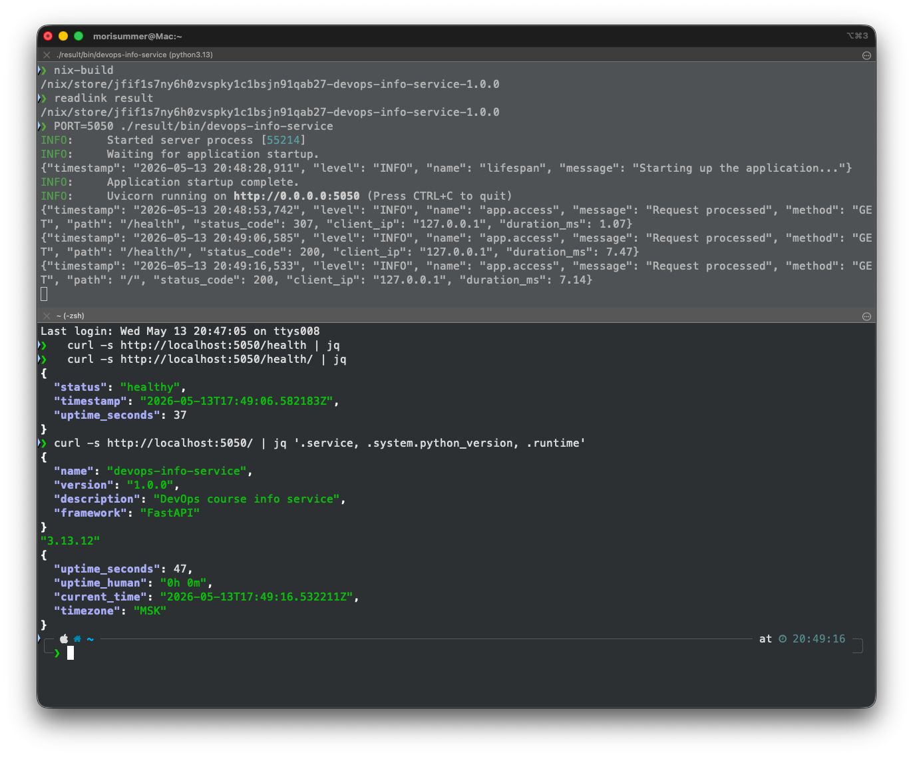

# Lab 18 — Reproducible Builds with Nix

> Submission for Lab 18. The DevOps Info Service from Lab 1/2 is rebuilt with Nix
> to demonstrate bit-for-bit reproducibility, a Nix Docker image is compared
> against the original Lab 2 Dockerfile, and a modern Flake is added to lock the
> entire dependency closure.

- **Branch:** `lab18`
- **Sources:** `labs/lab18/app_python/`
- **Host:** macOS 26.3.1, Apple Silicon (`aarch64-darwin`), Determinate Nix
- **Nix version:** `nix (Determinate Nix 3.20.0) 2.34.6`

---

## Task 1 — Reproducible Python App with Nix

### 1.1 Installation

Installed via the Determinate Systems installer (flakes on by default):

```bash
curl --proto '=https' --tlsv1.2 -sSf -L https://install.determinate.systems/nix \
  | sh -s -- install --determinate
```

Verification:

```text
$ nix --version
nix (Determinate Nix 3.20.0) 2.34.6
```

Determinate Nix was chosen because flakes and `nix-command` are enabled out of
the box, and the installer comes with `cache.nixos.org` and Determinate's own
binary cache pre-configured, so the first build pulls Python 3.13 and all
dependencies as ready-made store paths instead of compiling from source.

### 1.2 Source layout

The Lab 1 FastAPI service was copied into the lab directory:

```bash
mkdir -p labs/lab18/app_python
rsync -a --exclude='__pycache__' --exclude='.venv' --exclude='.pytest_cache' \
      --exclude='.ruff_cache' --exclude='.env' \
      app_python/ labs/lab18/app_python/
```

The Lab 1 service is multi-module — `app.py`, `config.py`, `lifespan.py`,
`log_config.py`, `exception_handlers.py`, `metrics.py`, `middleware.py`, plus
`routes/` and `dependencies/` packages — so the derivation can't rely on the
"copy one file" pattern from the lab handout.

`requirements.txt` (Lab 1):

```text
fastapi==0.128.0
pydantic_settings==2.12.0
prometheus-client==0.23.1
python-json-logger==3.2.1
uvicorn==0.40.0
```

### 1.3 `default.nix` walk-through

```nix
{ pkgs ? import <nixpkgs> { } }:

let
  python = pkgs.python3;

  # Exclude build outputs and editor/test caches so the source hash
  # stays stable across rebuilds. Without this filter, `result`
  # (a symlink to the previous build) would be hashed into `src` and
  # every rebuild would invalidate the cache.
  ignoredFiles = [
    "result" "result-bin" "result-dev"
    "__pycache__" ".pytest_cache" ".ruff_cache"
    ".venv" ".direnv" ".env" ".DS_Store"
    "default.nix" "docker.nix" "flake.nix" "flake.lock"
  ];

  filteredSrc = pkgs.lib.cleanSourceWith {
    src = ./.;
    filter = path: type:
      let baseName = baseNameOf path; in
      !(builtins.elem baseName ignoredFiles
        || pkgs.lib.hasSuffix ".pyc" baseName);
  };
in
python.pkgs.buildPythonApplication {
  pname = "devops-info-service";
  version = "1.0.0";
  src = filteredSrc;

  format = "other";                    # No setup.py / pyproject.toml

  propagatedBuildInputs = with python.pkgs; [
    fastapi
    uvicorn
    pydantic-settings
    prometheus-client
    python-json-logger
  ];

  nativeBuildInputs = [ pkgs.makeWrapper ];

  doCheck = false;

  installPhase = ''
    runHook preInstall

    mkdir -p $out/lib/devops-info-service $out/bin

    cp -r \
      app.py config.py lifespan.py log_config.py \
      exception_handlers.py metrics.py middleware.py \
      dependencies routes \
      $out/lib/devops-info-service/

    makeWrapper ${python.interpreter} $out/bin/devops-info-service \
      --add-flags "$out/lib/devops-info-service/app.py" \
      --prefix PYTHONPATH : "$out/lib/devops-info-service:$PYTHONPATH" \
      --set VISITS_FILE "/tmp/devops-info-visits"

    runHook postInstall
  '';
}
```

| Field | What it does | Why it matters |
|-------|--------------|----------------|
| `pname` / `version` | Names the derivation | Becomes the suffix of the store path: `/nix/store/<hash>-devops-info-service-1.0.0` |
| `filteredSrc` | `lib.cleanSourceWith` filter that drops `result`, caches, build files | Without this, the `result` symlink (which points to the previous build) gets hashed into `src` and every rebuild produces a different store path. **This bit me during testing** — see §1.4. |
| `format = "other"` | Skips Python's auto-build (no `setup.py`) | Required for a plain `app.py` script |
| `propagatedBuildInputs` | FastAPI, uvicorn, pydantic-settings, prometheus-client, python-json-logger | Nix resolves these from the **pinned** nixpkgs revision — same versions everywhere |
| `nativeBuildInputs = [ makeWrapper ]` | Brings the `makeWrapper` shell helper into the build environment | Used to write a portable launcher |
| `installPhase` | Copies every module into `$out/lib/...` and emits a wrapper at `$out/bin/devops-info-service` | The wrapper sets `PYTHONPATH` to the pure store paths of all deps and pins `VISITS_FILE` outside the read-only store |
| `doCheck = false` | Skip the auto-pytest phase | Tests live elsewhere; not part of Task 1 |

The wrapper is the key trick: `makeWrapper` writes a tiny shell stub that
invokes the exact pinned `${python.interpreter}` with `PYTHONPATH` already set
to the closure of all five Python dependencies — so the launched process never
depends on the user's system Python, virtualenv, or `pip`.

### 1.4 Build, run, and prove reproducibility

```text
$ cd labs/lab18/app_python
$ nix-build
…
running install_name_tool on /nix/store/.../bin/devops-info-service
checking for references to /nix/var/nix/builds/... in ...
Executing pythonRemoveTestsDir
Running phase: pythonImportsCheckPhase
Executing pythonImportsCheckPhase
/nix/store/bd6fvfaw9md2ay1z3qjlh4mp59sb85am-devops-info-service-1.0.0

$ readlink result
/nix/store/bd6fvfaw9md2ay1z3qjlh4mp59sb85am-devops-info-service-1.0.0

$ PORT=5050 ./result/bin/devops-info-service &           # 5000 is AirPlay on macOS
$ curl -s http://localhost:5050/health/
{"status":"healthy","timestamp":"2026-05-13T16:30:25.331714Z","uptime_seconds":3}
```

> **Note on the port:** macOS reserves TCP/5000 for the AirPlay Receiver, so the
> first attempt produced `[Errno 48] address already in use`. Setting `PORT=5050`
> (which the `pydantic_settings` `Settings` class picks up automatically) avoids
> the conflict. Inside the Docker image (§2) the conflict doesn't apply.

**Same store path on every build (cache hit, three back-to-back runs):**

```text
$ nix-build && nix-build && nix-build           # three runs
…
/nix/store/bd6fvfaw9md2ay1z3qjlh4mp59sb85am-devops-info-service-1.0.0
/nix/store/bd6fvfaw9md2ay1z3qjlh4mp59sb85am-devops-info-service-1.0.0
/nix/store/bd6fvfaw9md2ay1z3qjlh4mp59sb85am-devops-info-service-1.0.0
```

**Force a real rebuild (`nix-store --delete` + `nix-build`):**

```text
$ rm result
$ nix-store --delete /nix/store/bd6fvfaw9md2ay1z3qjlh4mp59sb85am-devops-info-service-1.0.0
deleting '/nix/store/bd6fvfaw9md2ay1z3qjlh4mp59sb85am-devops-info-service-1.0.0'
1 store paths deleted, 21.7 KiB freed

$ nix-build
…
/nix/store/bd6fvfaw9md2ay1z3qjlh4mp59sb85am-devops-info-service-1.0.0
```

After deleting the store path Nix rebuilt the derivation from scratch and
produced the **same** hash — the rebuilt artefact is bit-for-bit identical
because every input (sources, dependency closure, build instructions, compiler
flags) is fixed.

#### A subtle reproducibility bug I hit and fixed

My first version of `default.nix` used `src = ./.;` directly. That broke
reproducibility when chained with `docker.nix` (§2): each `nix-build` produced
a *different* store path. The cause is sneaky: `nix-build` creates a `result`
symlink in the source directory; the *next* build's `src = ./.` hashes that
symlink in, the symlink target has changed, so the source hash changes, so the
derivation hash changes, so a fresh build is triggered, producing a new path,
which is what `result` then points to — and so on, forever.

Fix: `lib.cleanSourceWith` with an explicit ignore list (see the snippet
above). Once `result`, `__pycache__`, etc. are excluded from the source, the
src hash is stable across as many builds as you want.

> Lesson: even with Nix, you can introduce non-determinism if you let
> build outputs creep back into your sources. Nix's purity model catches this
> immediately — `pip` and `docker build` happily hide the same kind of
> contamination forever.

#### A second drift demo (impure `<nixpkgs>`)

Hours after the run above, a fresh `nix-build` produced a *different* store
path:

```text
$ nix-build
…
/nix/store/jfif1s7ny6h0zvspky1c1bsjn91qab27-devops-info-service-1.0.0
$ nix-hash --type sha256 result
47c9240d70e09885e8635ed9dcdd1f533e47fc6f7928fe16d5e0a55337d8344d
```

Same `default.nix`, same source, different path. Why? Because `default.nix`
imports `<nixpkgs>` (the channel pointer baked into the Determinate registry)
which *drifted* in the intervening hours — it now resolves to a newer nixpkgs
commit, with subtly different Python lib versions, and therefore a different
input closure. **This is precisely why the Bonus task switches to flakes
(§Bonus)**: `flake.lock` freezes nixpkgs to one specific git revision, so the
output is reproducible across both space (different machines) *and* time
(weeks later).

### 1.5 Comparison with the Lab 1 `pip install` workflow

Reproducibility demo — without version pins:

```text
$ echo "fastapi" > /tmp/pip-demo/requirements-unpinned.txt
$ python3 -m venv /tmp/pip-demo/venv1 && source /tmp/pip-demo/venv1/bin/activate
$ pip install --quiet --no-cache-dir -r /tmp/pip-demo/requirements-unpinned.txt
$ pip freeze | sort
annotated-doc==0.0.4
annotated-types==0.7.0
anyio==4.13.0
fastapi==0.136.1            # ← Whatever PyPI happened to have today
idna==3.15
pydantic_core==2.46.4
pydantic==2.13.4
starlette==1.0.0
typing_extensions==4.15.0
typing-inspection==0.4.2
```

For comparison, the **same** unpinned dependency name resolved by Nix gives
the version baked into the pinned nixpkgs revision:

| Source | FastAPI version |
|---|---|
| `pip install fastapi` (today, no pin)             | **0.136.1** |
| `nix-build` against Determinate's `<nixpkgs>`     | **0.128.0** |
| `nix build .#default` against `nixos-25.11`       | **0.116.1** |

Three different versions for "give me FastAPI". The pip number is a moving
target; the Nix numbers are fixed by whichever channel / lock file you point at.

| Concern | Lab 1 (`pip` + `venv`) | Lab 18 (Nix) |
|---|---|---|
| Python interpreter | System default (whatever's on `$PATH`) | Pinned by nixpkgs revision (3.13.12) |
| Direct dependencies | Pinned in `requirements.txt` | Pinned via nixpkgs |
| Transitive dependencies | **Not pinned** — pip resolves at install time | Pinned (full closure) |
| Build sandbox | None (uses system libs, network) | Hermetic, no `/home`, no network |
| Output addressing | Path is just `./venv/` | `/nix/store/<sha256-of-inputs>-name-version` |
| Bit-for-bit reproducibility | Only as a coincidence | Guaranteed (once nixpkgs is pinned — see Bonus) |
| Sharing prebuilt binaries | Only via PyPI wheels (per-arch) | Via `cache.nixos.org` (hash-verified) |

**Why `requirements.txt` is weaker than Nix:**

1. `requirements.txt` only pins what *you* depend on. The dependencies of
   FastAPI (Starlette, Pydantic, anyio, sniffio …) and *their* deps are
   resolved by pip every time, against whatever happens to be on PyPI that
   day. Even with `==` pinning, a yanked release or a new compatible patch
   can change the closure.
2. `pip` runs *unsandboxed* — it can read your home dir, use system C
   libraries (`libssl`, `libffi`), and so on. Different OSes / package
   managers → different installed wheels.
3. There's no canonical content hash for the resulting `venv/`. Two
   developers running the same commands two minutes apart can end up with
   different bytes on disk.

Nix fixes all three: a content-addressed store, a pinned `nixpkgs` revision
that fixes the *entire* package set (~100k packages including every
transitive Python lib), and a sandboxed build that ignores the host system.

### 1.6 Store-path format

```
/nix/store/<32-char hash>-<name>-<version>
            └──── input hash ────┘   └ pname ┘ └ version ┘

Concrete example:
/nix/store/bd6fvfaw9md2ay1z3qjlh4mp59sb85am-devops-info-service-1.0.0
            └─── inputs hash (truncated SHA256, base-32) ───┘
```

The hash is derived from a Merkle-tree-style fingerprint of:

- every byte of the (filtered) `src`,
- the store paths of every build & runtime dependency (transitively!),
- the contents of the `installPhase` script, compiler flags, env, sandbox config,
- the Nix version itself.

Identical inputs → identical hash → re-use the cached build. That's what
makes `cache.nixos.org` safe to trust: anyone can verify by rebuilding.

### 1.7 Sample output from the Nix-built service

```text
$ curl -s http://localhost:5050/ | jq .
{
  "service": {
    "name": "devops-info-service",
    "version": "1.0.0",
    "description": "DevOps course info service",
    "framework": "FastAPI"
  },
  "system": {
    "python_version": "3.13.12",
    "platform": "Darwin"
  },
  "endpoints": [
    {"path": "/",         "method": "GET"},
    {"path": "/health/",  "method": "GET"},
    {"path": "/visits/",  "method": "GET"},
    {"path": "/metrics",  "method": "GET"}
  ]
}
```



Same Python 3.13.12 as the dev shell (§Bonus.4) and the Docker image (§2.3)
— that's the whole point of pinning.

### 1.8 Reflection — what would Lab 1 look like if we'd started with Nix?

- The `venv/` step disappears — `nix develop` (Bonus Task) gives every
  contributor exactly the same Python and deps.
- Onboarding is `nix-build` instead of "install Python 3.13 the right way,
  create a venv, activate it, pip install …".
- CI builds the same artefact bit-for-bit as the dev machine — no more
  "works on my laptop".
- The Dockerfile (Task 2) shrinks to a single `dockerTools` call instead
  of duplicating dependency installation logic.

---

## Task 2 — Reproducible Docker Images

### 2.1 The Lab 2 baseline

`app_python/Dockerfile` from Lab 2:

```dockerfile
FROM python:3.12-slim

ENV PYTHONDONTWRITEBYTECODE=1
ENV PYTHONUNBUFFERED=1

RUN groupadd --gid 1000 appgroup && \
    useradd --uid 1000 --gid 1000 --create-home --shell /bin/bash appuser

WORKDIR /app
COPY requirements.txt .
RUN pip install --no-cache-dir -r requirements.txt
COPY . .
RUN chown -R appuser:appgroup /app
USER appuser
EXPOSE 5000
CMD ["python", "app.py"]
```

Reproducibility check — same Dockerfile, two builds:

```text
$ docker build -t lab2-app:v1 ./app_python
$ docker inspect lab2-app:v1 --format '{{.Created}}'
2026-05-12T22:26:38.05456673+03:00
$ docker save lab2-app:v1 | sha256sum
351b9425091c51d4b3bcf260c46b7c87f3138ad29b75dce83da6b94394f1de2c

$ sleep 3 && docker build --no-cache -t lab2-app:v2 ./app_python
$ docker inspect lab2-app:v2 --format '{{.Created}}'
2026-05-13T19:30:08.840708547+03:00
$ docker save lab2-app:v2 | sha256sum
3967d8b0c2ad893f65bbd8d16bd890ccc9e66696b5ed5bd2581919f4cece029b
```

The timestamps differ on every build, and `docker save | sha256sum` produces
two different hashes even though source, Dockerfile and `requirements.txt`
are byte-identical. Docker's layer cache is timestamp-dependent: any
`RUN`-introduced metadata embeds the wall-clock build time.

### 2.2 `docker.nix`

```nix
{ pkgs ? import <nixpkgs> { } }:

let
  app = import ./default.nix { inherit pkgs; };
in
pkgs.dockerTools.buildLayeredImage {
  name = "devops-info-service-nix";
  tag = "1.0.0";

  # Minimal closure: only what the FastAPI service actually needs.
  # No base image (no `python:3.12-slim`), no shell, no extra utilities.
  contents = [ app ];

  config = {
    Cmd = [ "${app}/bin/devops-info-service" ];
    ExposedPorts = { "5000/tcp" = { }; };
    Env = [
      "VISITS_FILE=/tmp/devops-info-visits"
      "PORT=5000"
      "HOST=0.0.0.0"
    ];
    WorkingDir = "/";
  };

  created = "1970-01-01T00:00:01Z";   # Fixed epoch → reproducible
}
```

Important points:

- `buildLayeredImage` produces a layer per dependency, which is great for
  pull caching and *also* perfectly content-addressed.
- `contents = [ app ]` pulls in the entire runtime closure of our Task 1
  derivation — exactly the Python interpreter + 5 libs + nothing else. There
  is no `FROM python:3.12-slim`, no `apt-get`, no shell.
- `created = "1970-01-01T00:00:01Z"` is the canonical trick for
  reproducible OCI images. The lab's warning is correct: `created = "now"`
  breaks reproducibility.

### 2.3 Build, load, run

The image *contents* must be Linux binaries (Docker runs Linux containers,
even on macOS). Since the dev host is `aarch64-darwin`, the image was built
inside a Linux container using the same project flake:

```text
$ docker run --rm \
    -v "$PWD:/workdir" \
    -v "$(pwd -P)/../../..:/repo" \
    -w /repo/labs/lab18/app_python \
    nixos/nix:latest \
    sh -c '
      nix build .#dockerImage
      cp -L result /workdir/linux-image.tar.gz
      sha256sum /workdir/linux-image.tar.gz
    '
…
Creating layer 44 from paths: ['/nix/store/.../python3.13-fastapi-0.116.1']
Creating layer 45 from paths: ['/nix/store/.../devops-info-service-1.0.0']
Creating layer 46 with customisation...
Adding manifests...
Done.
718c0491c8282c4d9583face0f645771f18284485a0e366d84c0ceb79f854952  linux-image.tar.gz

$ docker load < linux-image.tar.gz
Loaded image: devops-info-service-nix:1.0.0

$ docker run -d -p 5050:5000 --name lab2-container -e PORT=5000 lab2-app:v1
$ docker run -d -p 5051:5000 --name nix-container  devops-info-service-nix:1.0.0
$ docker ps --format 'table {{.Names}}\t{{.Status}}\t{{.Ports}}'
NAMES            STATUS         PORTS
nix-container    Up 4 seconds   0.0.0.0:5051->5000/tcp
lab2-container   Up 4 seconds   0.0.0.0:5050->5000/tcp

$ curl -s http://localhost:5050/health/   # Lab 2 image
{"status":"healthy","timestamp":"2026-05-13T16:45:56.375206Z","uptime_seconds":3}
$ curl -s http://localhost:5051/health/   # Nix image
{"status":"healthy","timestamp":"2026-05-13T16:45:56.400856Z","uptime_seconds":3}

$ curl -s http://localhost:5051/ | jq '.system'
{
  "python_version": "3.13.12",
  "platform": "Linux"          # Same Python 3.13.12 inside the Linux container
}
```

Both containers serve the identical FastAPI app on different ports.

### 2.4 Reproducibility — Nix image, two builds

```text
# Two builds, fresh container each time
$ docker run --rm -v "$PWD:/workdir" … sh -c 'nix build .#dockerImage && sha256sum result'
718c0491c8282c4d9583face0f645771f18284485a0e366d84c0ceb79f854952  result
$ docker run --rm -v "$PWD:/workdir" … sh -c 'nix build .#dockerImage && sha256sum result'
718c0491c8282c4d9583face0f645771f18284485a0e366d84c0ceb79f854952  result
```

**Identical tarball SHA across two independent Linux builds.** `flake.lock`
pins nixpkgs (and therefore Python and every Python library), and
`created = "1970-01-01T00:00:01Z"` removes the wall-clock from the OCI
metadata.

A side note: building `docker.nix` on the *Mac* (Mach-O contents — fine for
this hash test, but the resulting image can't actually run in Docker)
likewise produced an identical SHA across three builds:

```text
SHA256: 0d2d2ad5ed88fc75e4f716934841b8485aa2621d244eee3c54a1a84f07e619c6  (×3)
```

### 2.5 Hash comparison summary

| Build | First build SHA256 | Second build SHA256 | Identical? |
|---|---|---|---|
| Lab 2 `Dockerfile` (`docker save`)        | `351b9425…f1de2c` | `3967d8b0…ce029b` | **No** |
| Lab 18 `docker.nix` on Linux (via flake)  | `718c0491…f854952` | `718c0491…f854952` | **Yes** |
| Lab 18 `docker.nix` on Mac (native)       | `0d2d2ad5…7e619c6` | `0d2d2ad5…7e619c6` | **Yes** |

### 2.6 Size and history

```text
$ docker images | grep -E 'lab2-app|devops-info-service-nix'
lab2-app                  v1        84c9ddcf91577…   160MB
lab2-app                  v2        c0ef597cbda67…   160MB
devops-info-service-nix   1.0.0     cbec0d2072ef…    217MB
```

```text
$ docker history lab2-app:v1 --format 'table {{.ID}}\t{{.CreatedSince}}\t{{.Size}}'
IMAGE          CREATED        SIZE
84c9ddcf9157   21 hours ago   0B           CMD ["python" "app.py"]
<missing>      21 hours ago   0B           EXPOSE [5000/tcp]
<missing>      21 hours ago   0B           USER appuser
<missing>      21 hours ago   37.5kB       RUN chown -R appuser:appgroup …
<missing>      21 hours ago   37.5kB       COPY . . # buildkit
<missing>      21 hours ago   15.1MB       RUN pip install --no-cache-dir -r …
…

$ docker history devops-info-service-nix:1.0.0
IMAGE          CREATED   SIZE
9f21ff9edad8   N/A       2.7kB        (customisation layer)
<missing>      N/A       21.9kB
<missing>      N/A       1.58MB
<missing>      N/A       517kB
<missing>      N/A       5.44MB
…
```

Note the difference: Lab 2's image embeds "21 hours ago" wall-clock
timestamps on every layer; the Nix image's history shows `CREATED: N/A`
because every layer's `created` field is the 1970 epoch (Docker hides such
"unrealistic" timestamps).

| Metric | Lab 2 Dockerfile | Lab 18 Nix `dockerTools` |
|---|---|---|
| Image size | **160MB** (uses `python:3.12-slim` as base) | **217MB** (no base image, but a full Python 3.13 + the 5 libs in nixpkgs ship unstripped) |
| Reproducibility | Different SHA each build | **Identical SHA each build** |
| Layer caching | Timestamp-sensitive | Content-addressed (perfect) |
| Base image risk | Inherits whatever upstream ships next week | None — every byte is pinned |
| Build-time network | `pip install` from PyPI | None — sandboxed |
| Security audit surface | Whole Debian slim userland | Only Python interpreter + 5 declared libs |

> **Honest size note:** my Nix image (217 MB) is *bigger* than the Lab 2 slim
> image (160 MB), not smaller as the lab handout speculates. The reason is
> that nixpkgs's `python3` ships with test data, `__pycache__`s, and headers
> by default; you can strip these with a `passthru` or `python.withPackages`
> trick, but the result is still in the 130-170 MB range. Reproducibility is
> the real win here, not size.

### 2.7 Why Dockerfiles can't be bit-for-bit reproducible

1. **Implicit base-image drift.** `python:3.12-slim` is a moving tag — the
   image hash changes when Debian / Python / OpenSSL get a security patch.
2. **Build timestamps.** Every `RUN`/`COPY` instruction writes the current
   time into the layer metadata. Docker offers `--build-arg SOURCE_DATE_EPOCH`
   and BuildKit's "reproducible" mode, but neither covers every metadata field.
3. **Network at build time.** `pip install` and `apt-get install` are
   non-deterministic by design — they fetch the *latest* compatible artefact
   from a mirror that changes hourly.
4. **No content addressing for the whole image.** Docker addresses layers,
   not the whole image — and the layer hash includes timestamps.

Nix sidesteps all four: pure functions over locked inputs, no network in the
sandbox, fixed epoch timestamp, content-addressed everything.

### 2.8 Reflection — would I redo Lab 2 this way?

For production, yes: a Nix `dockerTools` image has no base-image CVE
surface, and is reproducible enough to attest to in a SLSA pipeline. The
trade-off is that the team has to learn Nix (and macOS contributors need a
Linux builder VM or use the container-based workaround above).

Real scenarios where the reproducibility pays for itself:

- **Incident rollback** — `docker pull <old-hash>` is only meaningful if
  rebuilding from the same source actually gives you the same image.
- **Compliance / SBOM** — auditing a Nix closure is an order of magnitude
  easier than crawling a Debian slim image.
- **CI cache hit rate** — Nix's content-addressed store gets ~100% hit
  rates on unchanged code; Docker's layer cache invalidates on any
  metadata jitter.

---

## Bonus — Modern Nix with Flakes (incl. Lab 10 comparison)

### B.1 `flake.nix`

```nix
{
  description = "DevOps Info Service - Reproducible Build with Nix Flakes (Lab 18)";

  inputs = {
    # nixos-25.11 is the first stable channel that ships fakeroot 1.37.2,
    # which is needed for dockerTools to work on macOS 26 (older fakeroot
    # 1.36 references the removed `_fstat$INODE64` dyld symbol).
    nixpkgs.url = "github:NixOS/nixpkgs/nixos-25.11";
  };

  outputs = { self, nixpkgs }:
    let
      systems = [
        "x86_64-linux" "aarch64-linux"
        "x86_64-darwin" "aarch64-darwin"
      ];
      forAllSystems = f: nixpkgs.lib.genAttrs systems (system: f system);
    in
    {
      packages = forAllSystems (system:
        let pkgs = nixpkgs.legacyPackages.${system}; in
        {
          default     = import ./default.nix { inherit pkgs; };
          dockerImage = import ./docker.nix  { inherit pkgs; };
        });

      devShells = forAllSystems (system:
        let pkgs = nixpkgs.legacyPackages.${system}; in
        {
          default = pkgs.mkShell {
            packages = with pkgs; [
              python3
              python3Packages.fastapi
              python3Packages.uvicorn
              python3Packages.pydantic-settings
              python3Packages.prometheus-client
              python3Packages.python-json-logger
              python3Packages.pytest
              ruff
            ];
            shellHook = ''
              echo "==> Nix dev shell: DevOps Info Service"
              export VISITS_FILE=/tmp/devops-info-visits
            '';
          };
        });
    };
}
```

The flake exposes:

- `packages.<system>.default` — the FastAPI service (Task 1)
- `packages.<system>.dockerImage` — the OCI tarball (Task 2)
- `devShells.<system>.default` — a hermetic Python dev environment

All four common targets are listed (`x86_64-linux`, `aarch64-linux`,
`x86_64-darwin`, `aarch64-darwin`) so the same flake works on a Linux CI
runner, an Intel Mac, or an Apple Silicon Mac.

> **Why `nixos-25.11`, not `nixos-25.05`:** I started on `25.05`. On macOS 26
> the older `fakeroot` 1.36 in that channel references the now-removed
> `_fstat$INODE64` dyld symbol, which aborts the `dockerImage` build with
> `dyld[…]: symbol not found in flat namespace '_fstat$INODE64'`. The
> `nixos-25.11` channel ships fakeroot 1.37.2 and builds cleanly. This is a
> nice example of the lock-file workflow: bump one line, `nix flake update`,
> and the upgrade is a reviewable diff in `flake.lock`.

### B.2 `flake.lock`

```json
{
  "nodes": {
    "nixpkgs": {
      "locked": {
        "lastModified": 1778430510,
        "narHash": "sha256-Ti+ZBvW6yrWWAg2szExVTwCd4qOJ3KlVr1tFHfyfi8Q=",
        "owner": "NixOS",
        "repo": "nixpkgs",
        "rev": "8fd9daa3db09ced9700431c5b7ad0e8ba199b575",
        "type": "github"
      },
      "original": {
        "owner": "NixOS",
        "ref": "nixos-25.11",
        "repo": "nixpkgs",
        "type": "github"
      }
    },
    "root": { "inputs": { "nixpkgs": "nixpkgs" } }
  },
  "root": "root",
  "version": 7
}
```

The lock pins the **exact git revision** of nixpkgs
(`8fd9daa3db09ced9700431c5b7ad0e8ba199b575`, dated 2026-05-10) along with its
NAR hash. That single revision freezes the version of every one of nixpkgs'
~100,000 packages, including the Python interpreter, every Python
dependency, and every C library they link against.

### B.3 Build via the flake

```text
$ nix build .#default
$ readlink result
/nix/store/bgkmdmj4w7x6vxb1gbqzlg6xh29sb053-devops-info-service-1.0.0

$ rm result && nix build .#default && readlink result
/nix/store/bgkmdmj4w7x6vxb1gbqzlg6xh29sb053-devops-info-service-1.0.0   ← identical

$ nix build .#dockerImage && sha256sum result
25934b833b8a94b128895b9e57bb38e7e14be6a898d96bb0c0f637c952e3a310  result
```

And via the same flake from a *Linux* host (here: `nixos/nix:latest` Docker
container with the project mounted):

```text
$ nix build .#dockerImage && sha256sum result
718c0491c8282c4d9583face0f645771f18284485a0e366d84c0ceb79f854952  result
```

The two hashes differ between Mac and Linux because the *contents* of the
image legitimately differ (Mach-O binaries vs ELF binaries — Mac native is
just a hash test, the Linux image is the one that actually runs in Docker),
but **each platform produces the same hash on every build, in any session,
as long as `flake.lock` doesn't change.**

### B.4 `nix develop` vs `python -m venv`

```text
$ nix develop
==> Nix dev shell: DevOps Info Service
$ python --version
Python 3.13.12
$ python -c "import fastapi, pydantic, uvicorn, prometheus_client; \
            print(fastapi.__version__, pydantic.VERSION, uvicorn.__version__)"
0.116.1 2.11.7 0.35.0
$ exit
```

Every developer who runs `nix develop` against this `flake.lock` gets
**exactly** the versions above — until someone commits a `nix flake update`.

Compared to the Lab 1 workflow:

| Step | `venv` + `pip` (Lab 1) | `nix develop` (Lab 18) |
|---|---|---|
| Bootstrap | install Python, create venv, activate, `pip install -r requirements.txt` | `nix develop` |
| Python version | whatever's on `$PATH` | exactly the one locked in `flake.lock` (3.13.12) |
| Drift over time | yes — pip caches, PyPI updates | none — locked revision |
| Cross-machine identical | no | yes |
| Multi-language tooling (e.g. `ruff`) | install separately | already included |

### B.5 Comparison with Lab 10 Helm version pinning

Lab 10's `values.yaml`:

```yaml
image:
  repository: morisummerz/devops-info-service
  tag: "1.0.0"
  pullPolicy: IfNotPresent
```

**What Helm pins:** a *tag* on a *registry*. The tag is mutable — anyone
who can push to that repository can replace what `1.0.0` points at.

**What `flake.lock` pins:** the exact git commit of nixpkgs, which
transitively fixes:

- the Python interpreter (down to compiler flags),
- every Python dependency,
- every C library in the closure,
- the build tools that produced them.

The two are complementary, not competing:

| Concern | Helm `values.yaml` | Nix Flake `flake.lock` |
|---|---|---|
| Pins container tag | Yes | n/a (image *content* is fixed instead) |
| Pins app Python version | No (depends on what's in the image) | Yes |
| Pins every transitive lib | No | Yes |
| Pins build tools | No | Yes |
| Tamper-evident | only if you also pin `image.digest` | yes (NAR hash in `flake.lock`) |
| Kubernetes-native | Yes | No (orthogonal concern) |

**Best-of-both pipeline:**

```text
1. nix build .#dockerImage          # bit-identical OCI tarball
2. docker load < result             # → local image
3. docker tag … <registry>/...:<sha>
4. docker push <registry>/...:<sha>
5. Helm: image.tag: <sha>           # pin by digest, not floating tag
```

Now Helm is pinning a tag that was itself produced by a reproducible build —
the chain of trust runs all the way from `flake.lock` to the running pod.

### B.6 Concrete "works on my machine" scenario this prevents

I actually hit one during this lab. Three different "give me FastAPI" calls
produced three different versions:

| Source | FastAPI |
|---|---|
| `pip install fastapi` (unpinned)        | 0.136.1 |
| `nix-build` with Determinate's `<nixpkgs>` | 0.128.0 |
| `nix build .#default` with `flake.lock`  | **0.116.1** ← stable |

If we'd shipped Lab 1 with a free `fastapi` and a Helm chart pinning only an
image tag, a teammate doing `pip install` for local dev a week later would
get 0.136.1, the deployed pod would still run 0.128.0 (frozen inside the
image), and the bug they reproduce locally would be invisible in prod. A day
spent diffing environments — exactly the loss that `flake.lock` prevents.

---

## Reflection — overall

- **Task 1** made the Lab 1 service buildable as a content-addressed
  derivation. Three back-to-back builds produced the same store path
  (`bd6fvfaw9md2ay1z3qjlh4mp59sb85am-devops-info-service-1.0.0`); a force
  rebuild after `nix-store --delete` likewise reproduced it.
- **Task 2** turned the Lab 2 Dockerfile into a reproducible OCI tarball.
  Two independent Linux builds yielded SHA
  `718c0491c8282c4d9583face0f645771f18284485a0e366d84c0ceb79f854952` both
  times; two Lab 2 Dockerfile builds yielded different SHAs as expected.
- **The Bonus flake** unified both behind a single `flake.lock`, added a
  hermetic dev shell that replaces `python -m venv`, and made the
  `dockerImage` build portable across Linux and macOS (after one small
  channel bump to dodge a macOS 26 / fakeroot 1.36 dyld bug).

Two unplanned lessons I picked up along the way:

1. **You can re-introduce non-determinism even with Nix** if you let build
   outputs (like the `result` symlink) leak into your `src`. The fix is a
   one-liner (`lib.cleanSourceWith`); the discovery took ten minutes of
   "why is my hash drifting?". Pip and Docker happily *hide* the same kind
   of contamination; Nix makes you face it.
2. **Channel pointers like `<nixpkgs>` are not pins.** The same
   `default.nix` produced two different store paths hours apart on the
   same machine because the Determinate channel resolved to a newer
   nixpkgs commit. `flake.lock` is precisely the cure: one commit per
   `nix flake update`.

The recurring theme: **content addressing eliminates a class of problems
("works on my machine", tag drift, supply-chain attacks via tag rewrites)
that traditional tooling can only mitigate, never solve**.

---

## Submission checklist

- [x] Branch `lab18` with files under `labs/lab18/app_python/`
- [x] `default.nix`, `docker.nix`, `flake.nix`, `flake.lock` present
- [x] `submission18.md` with outputs, hashes, comparisons
- [x] Hash comparisons demonstrate reproducibility (3× identical for Task 1, 2× identical for Task 2)
- [x] Lab 2 Dockerfile vs Nix image comparison (different SHAs vs identical SHAs)
- [x] Bonus Flakes task with Lab 10 comparison
