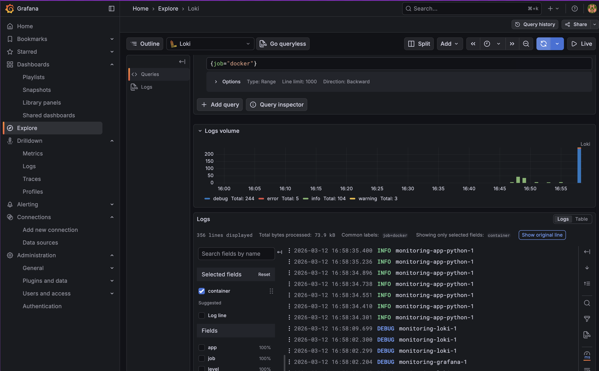
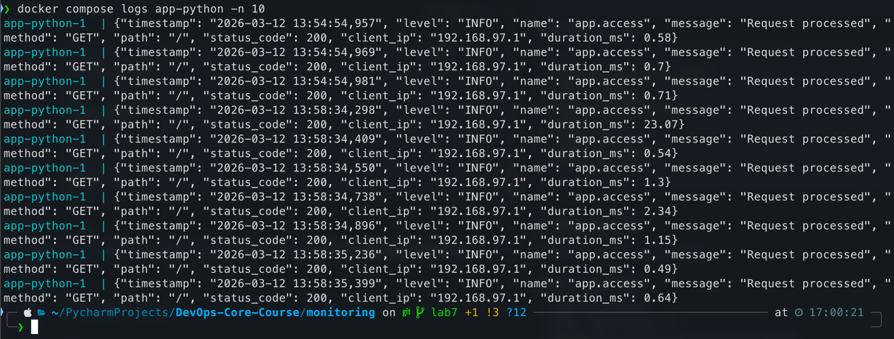
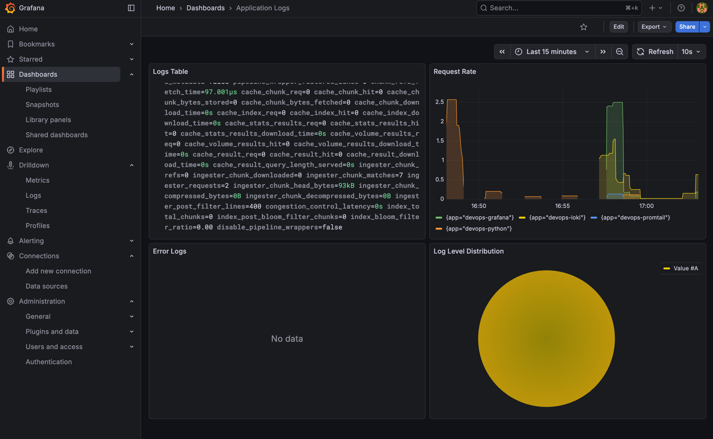
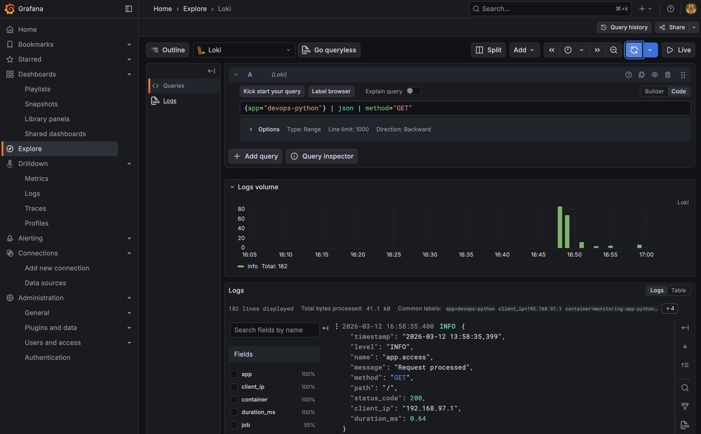
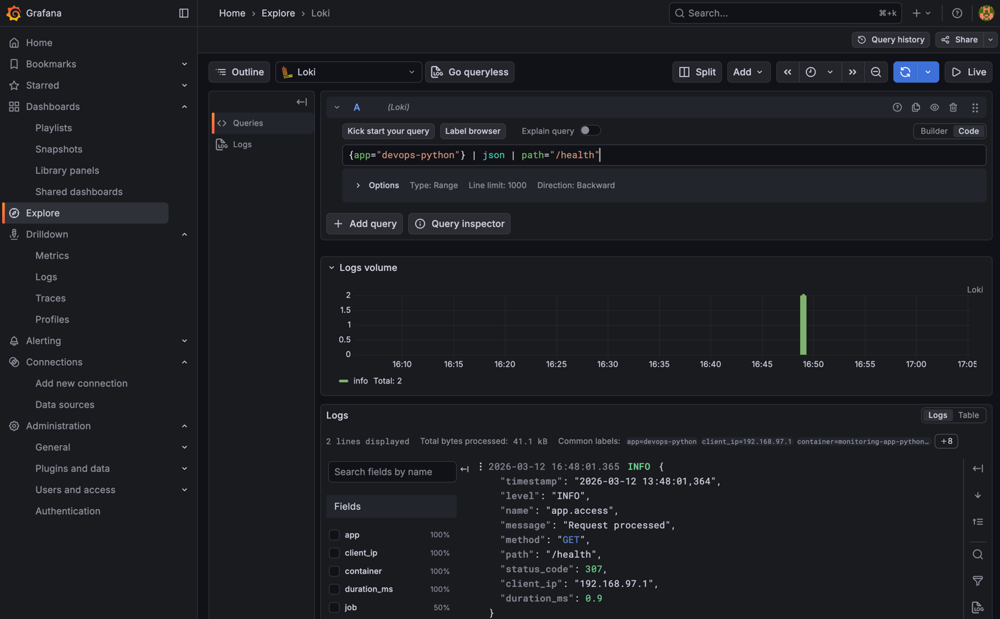
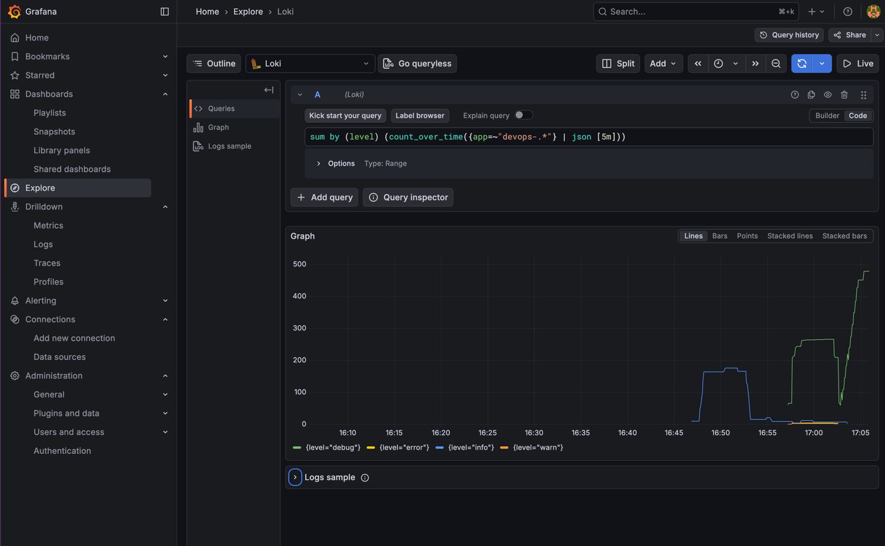
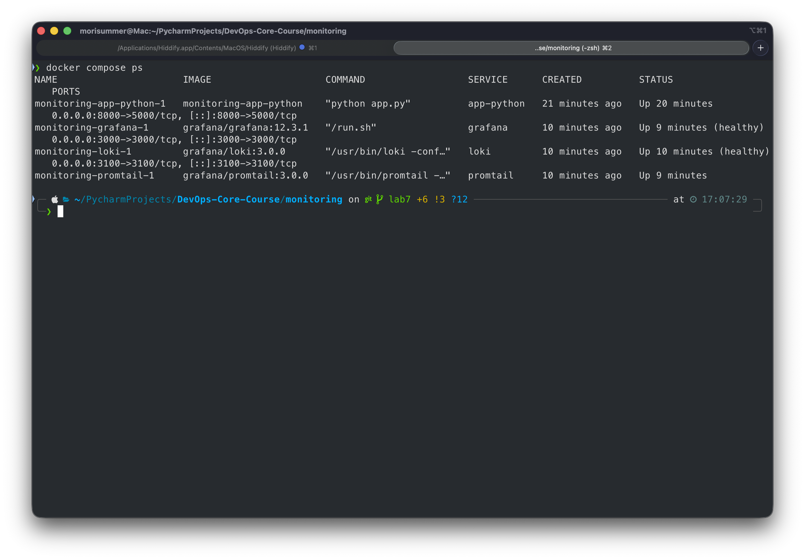
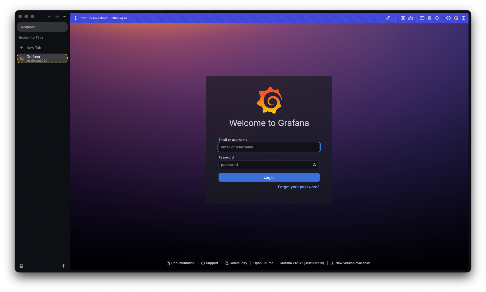

# Lab 7 - Observability & Logging with Loki Stack

## 1. Architecture

```
+-------------------+     +-------------------+     +-------------------+
|   app-python      |     |    Promtail        |     |      Loki         |
|   (FastAPI)       |---->|  (Log Collector)   |---->|  (Log Storage)    |
|   port 8000       |     |  Docker SD         |     |  TSDB + FS        |
+-------------------+     +-------------------+     |  port 3100        |
        |                         |                  +-------------------+
        |    Docker logs          |                          |
        +-------------------------+                          |
                                                             v
                                                  +-------------------+
                                                  |     Grafana       |
                                                  |  (Visualization)  |
                                                  |   port 3000       |
                                                  +-------------------+
```

**Data Flow:**

1. **app-python** writes JSON-structured logs to stdout
2. Docker captures stdout/stderr as container logs in `/var/lib/docker/containers/`
3. **Promtail** discovers containers via Docker socket, filters by `logging=promtail` label
4. Promtail pushes logs to **Loki** via `/loki/api/v1/push`
5. **Grafana** queries Loki using LogQL to visualize logs

**Key Design Decisions:**

- **Loki 3.0 with TSDB** - Up to 10x faster queries vs boltdb-shipper
- **Docker service discovery** - Automatic container detection, no manual log paths
- **Label-based filtering** - Only containers with `logging=promtail` are scraped

## 2. Setup Guide

### Prerequisites

- Docker and Docker Compose v2 installed
- Python application from Lab 1

### Deployment

```bash
cd monitoring

# Copy and configure environment
cp .env.example .env
# Edit .env to set Grafana admin password

# Start the stack
docker compose up -d

# Verify all services are healthy
docker compose ps

# Test Loki readiness
curl http://localhost:3100/ready

# Access Grafana
open http://localhost:3000
```

### Generate Test Logs

```bash
# Send requests to generate application logs
for i in {1..20}; do curl http://localhost:8000/; done
for i in {1..20}; do curl http://localhost:8000/health; done
```



## 3. Configuration

### Loki (`loki/config.yml`)

Key configuration choices:

```yaml
# TSDB storage - recommended for Loki 3.0+, faster than boltdb-shipper
schema_config:
  configs:
    - from: "2024-01-01"
      store: tsdb
      object_store: filesystem
      schema: v13

# 7-day retention with compactor cleanup
limits_config:
  retention_period: 168h

compactor:
  retention_enabled: true
```

- **`auth_enabled: false`** - Single-tenant mode for development
- **`schema: v13`** - Latest schema version for Loki 3.0
- **`tsdb` store** - Uses Time Series Database for indexing (10x faster queries)
- **`filesystem` object store** - Local storage for single-instance deployment
- **Compactor** - Runs every 10 minutes to enforce retention and reclaim space

### Promtail (`promtail/config.yml`)

```yaml
# Docker service discovery with label filtering
scrape_configs:
  - job_name: docker
    docker_sd_configs:
      - host: unix:///var/run/docker.sock
        filters:
          - name: label
            values: [ "logging=promtail" ]
    relabel_configs:
      - source_labels: [ "__meta_docker_container_name" ]
        regex: "/?(.*)"
        target_label: "container"
      - source_labels: [ "__meta_docker_container_label_app" ]
        target_label: "app"
```

- **Docker SD** - Discovers containers automatically via Docker socket
- **Label filter** - Only scrapes containers with `logging=promtail` Docker label
- **Relabeling** - Extracts `container` name (strips leading `/`) and `app` label for LogQL queries
- Containers without an `app` label are dropped

## 4. Application Logging

### JSON Structured Logging Implementation

The Python FastAPI app uses `python-json-logger` for structured JSON output.

**Log configuration (`log_config.py`):**

```python
from pythonjsonlogger.json import JsonFormatter


def setup_json_logging():
    formatter = JsonFormatter(
        fmt="%(asctime)s %(levelname)s %(name)s %(message)s",
        rename_fields={"asctime": "timestamp", "levelname": "level"},
    )
    handler = logging.StreamHandler(sys.stdout)
    handler.setFormatter(formatter)
    root_logger = logging.getLogger()
    root_logger.handlers.clear()
    root_logger.addHandler(handler)
```

**Request logging middleware (`middleware.py`):**

```python
class RequestLoggingMiddleware(BaseHTTPMiddleware):
    async def dispatch(self, request, call_next):
        response = await call_next(request)
        logger.info("Request processed", extra={
            "method": request.method,
            "path": request.url.path,
            "status_code": response.status_code,
            "client_ip": request.client.host,
            "duration_ms": duration_ms,
        })
        return response
```

**Sample JSON log output:**

```json
{
  "timestamp": "2026-03-12 14:30:00",
  "level": "INFO",
  "name": "app.access",
  "message": "Request processed",
  "method": "GET",
  "path": "/",
  "status_code": 200,
  "client_ip": "172.18.0.1",
  "duration_ms": 5.23
}
```



## 5. Dashboard

The Grafana dashboard contains 4 panels:

### Panel 1: Logs Table

- **Type:** Logs visualization
- **Query:** `{app=~"devops-.*"}`
- **Purpose:** Shows recent logs from all applications in real-time

### Panel 2: Request Rate

- **Type:** Time series graph
- **Query:** `sum by (app) (rate({app=~"devops-.*"} [1m]))`
- **Purpose:** Visualizes log throughput per application over time

### Panel 3: Error Logs

- **Type:** Logs visualization
- **Query:** `{app=~"devops-.*"} | json | level="ERROR"`
- **Purpose:** Filters and displays only ERROR-level logs for quick incident detection

### Panel 4: Log Level Distribution

- **Type:** Stat/Pie chart
- **Query:** `sum by (level) (count_over_time({app=~"devops-.*"} | json [5m]))`
- **Purpose:** Shows breakdown of log levels (INFO, WARNING, ERROR) over last 5 minutes



### Additional LogQL Queries

```logql
# All logs from Python app
{app="devops-python"}

# Filter by HTTP method
{app="devops-python"} | json | method="GET"

# Slow requests (> 100ms)
{app="devops-python"} | json | duration_ms > 100

# Logs by path
{app="devops-python"} | json | path="/"

# Error rate over time
sum(rate({app="devops-python"} | json | level="ERROR" [5m]))
```





## 6. Production Configuration

### Resource Limits

All services have resource constraints to prevent runaway resource consumption:

| Service  | CPU Limit | Memory Limit | CPU Reservation | Memory Reservation |
|----------|-----------|--------------|-----------------|--------------------|
| Loki     | 1.0       | 1G           | 0.25            | 256M               |
| Promtail | 0.5       | 512M         | 0.1             | 128M               |
| Grafana  | 1.0       | 512M         | 0.25            | 256M               |
| App      | 0.5       | 256M         | 0.1             | 128M               |

### Security

- **Grafana anonymous access disabled** - `GF_AUTH_ANONYMOUS_ENABLED=false`
- **Admin credentials via `.env` file** - Not committed to version control
- **Docker socket mounted read-only** - Promtail has read-only access
- **Config files mounted read-only** - All `:ro` mount flags
- **Non-root app container** - Python app runs as `appuser` (UID 1000)

### Health Checks

- **Loki:** `wget http://localhost:3100/ready` (interval: 10s, retries: 5)
- **Grafana:** `wget http://localhost:3000/api/health` (interval: 10s, retries: 5)
- **Dependency ordering:** Promtail and Grafana wait for Loki to be healthy




### Log Retention

- Retention period: **7 days (168h)**
- Compactor runs every **10 minutes** to enforce retention
- TSDB index period: **24 hours**

## 7. Testing

### Verify Stack Deployment

```bash
# Check all services are running and healthy
docker compose ps

# Test Loki readiness
curl -s http://localhost:3100/ready
# Expected: "ready"

# Test Grafana health
curl -s http://localhost:3000/api/health
# Expected: {"commit":"...","database":"ok","version":"12.3.1"}

# Check Promtail targets
curl -s http://localhost:9080/targets
```

### Verify Log Collection

```bash
# Generate traffic
for i in {1..10}; do curl -s http://localhost:8000/ > /dev/null; done

# Query Loki directly for logs
curl -s "http://localhost:3100/loki/api/v1/query_range" \
  --data-urlencode 'query={app="devops-python"}' \
  --data-urlencode 'limit=5' | python3 -m json.tool
```

### Verify Grafana Data Source

```bash
# Check provisioned data sources
curl -s -u admin:devops2024secure http://localhost:3000/api/datasources | python3 -m json.tool
```

## 8. Challenges

### Docker Socket Security

Mounting the Docker socket gives Promtail full access to the Docker API. In production, consider using a socket proxy
like `tecnativa/docker-socket-proxy` to limit API access.

### Loki 3.0 TSDB Migration

The `tsdb` store type is the recommended default in Loki 3.0, replacing `boltdb-shipper`. This required using
`schema: v13` and configuring `tsdb_shipper` in `storage_config`.

### Container Label Filtering

Using `docker_sd_configs` with label filters ensures only explicitly labeled containers are scraped, preventing noise
from infrastructure containers (Loki, Promtail, Grafana themselves).

### Grafana Data Source Provisioning

Instead of manually adding the Loki data source via UI, it's provisioned automatically using Grafana's file-based
provisioning at `/etc/grafana/provisioning/datasources/loki.yml`.

## Bonus: Ansible Automation

An Ansible role `monitoring` was created to automate the full deployment:

```
ansible/roles/monitoring/
├── defaults/main.yml           # Configurable variables
├── tasks/
│   ├── main.yml               # Orchestration
│   ├── setup.yml              # Directory creation, config templating
│   └── deploy.yml             # Docker Compose deployment + health checks
├── templates/
│   ├── docker-compose.yml.j2  # Parameterized compose file
│   ├── loki-config.yml.j2     # Loki configuration template
│   ├── promtail-config.yml.j2 # Promtail configuration template
│   └── grafana-datasource.yml.j2
└── meta/main.yml              # Depends on: docker role
```

**Deploy with Ansible:**

```bash
cd ansible
ansible-playbook playbooks/deploy-monitoring.yml
```

**Configurable variables** (in `defaults/main.yml`):

- Service versions, ports, retention period
- Grafana credentials, resource limits
- All values parameterized via Jinja2 templates
