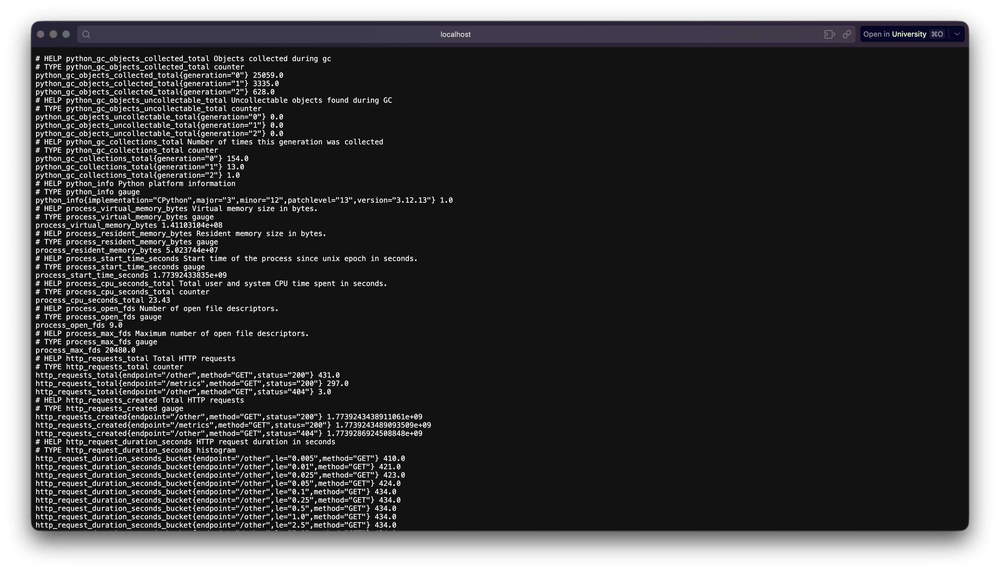
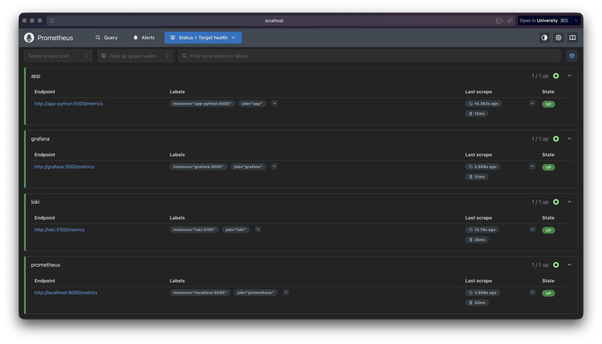
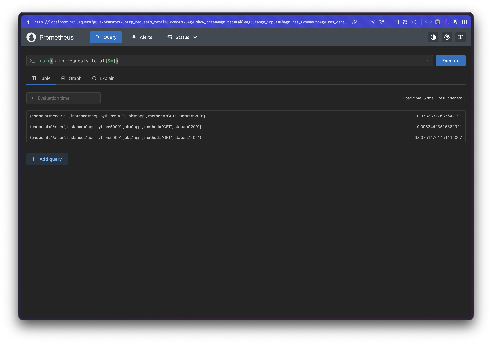
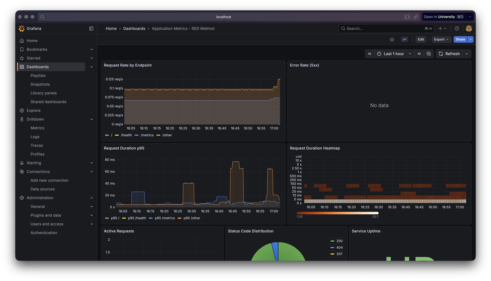
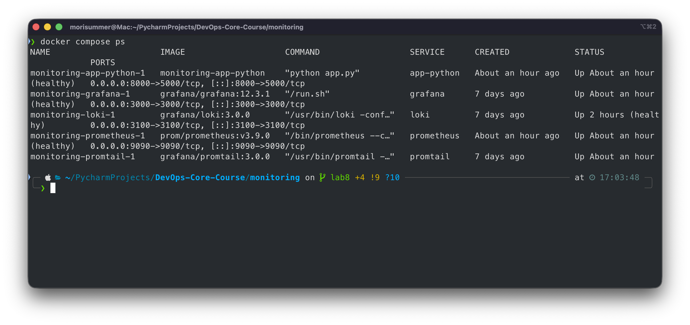
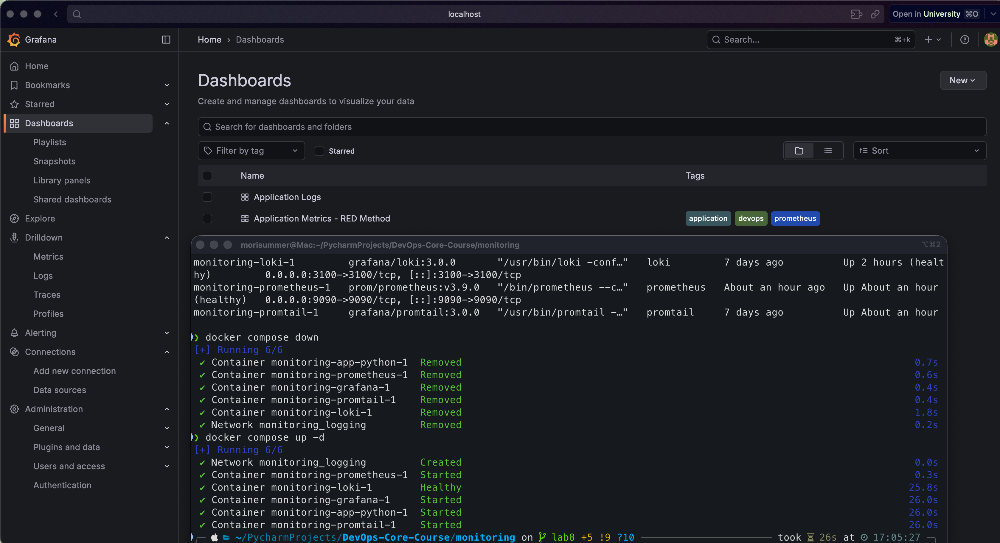
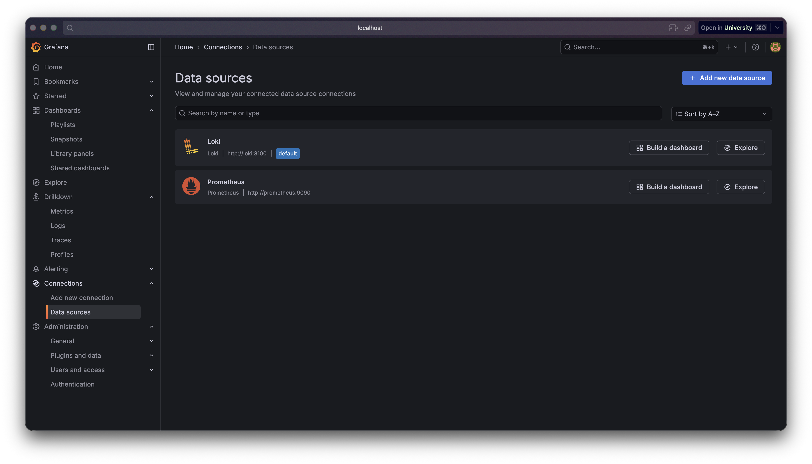
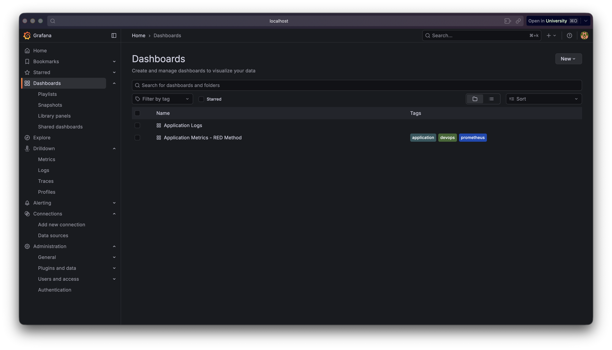

# Lab 8 — Metrics & Monitoring with Prometheus

## 1. Architecture

```
┌──────────────┐     ┌──────────────┐     ┌──────────────┐
│  app-python  │     │     Loki     │     │   Grafana    │
│   :5000      │     │    :3100     │     │    :3000     │
│  /metrics ◄──┼─┐   │              │     │  Dashboards  │
│  /health     │ │   │              │     │  - Logs      │
│  /           │ │   │              │     │  - Metrics   │
└──────────────┘ │   └──────┬───────┘     └──────┬───────┘
                 │          ▲                     │
                 │          │ push logs           │ query
                 │   ┌──────┴───────┐             │
                 │   │   Promtail   │             │
                 │   │    :9080     │             │
                 │   │ Docker SD    │             │
                 │   └──────────────┘             │
                 │                                │
                 │   ┌──────────────┐             │
                 └──►│  Prometheus  │◄────────────┘
                     │    :9090     │
                     │  Scrapes:    │
                     │  - app       │
                     │  - loki      │
                     │  - grafana   │
                     │  - self      │
                     └──────────────┘
```

**Data flow:**

- **Metrics path:** Application exposes `/metrics` endpoint → Prometheus scrapes every 15s → Grafana queries Prometheus
  for visualization
- **Logs path (Lab 7):** Containers produce logs → Promtail ships to Loki → Grafana queries Loki for log exploration

## 2. Application Instrumentation

### Metric Definitions

We instrument the FastAPI app following the **RED Method** (Rate, Errors, Duration):

| Metric                                  | Type      | Labels                   | Purpose                                       |
|-----------------------------------------|-----------|--------------------------|-----------------------------------------------|
| `http_requests_total`                   | Counter   | method, endpoint, status | Track total request count (Rate & Errors)     |
| `http_request_duration_seconds`         | Histogram | method, endpoint         | Track request latency distribution (Duration) |
| `http_requests_in_progress`             | Gauge     | —                        | Track concurrent request count                |
| `devops_info_endpoint_calls_total`      | Counter   | endpoint                 | Business metric: track endpoint usage         |
| `devops_info_system_collection_seconds` | Histogram | —                        | Business metric: system info collection time  |

### Code: Metric Definitions (`metrics.py`)

```python
from prometheus_client import Counter, Gauge, Histogram

# RED Method metrics
http_requests_total = Counter(
    "http_requests_total",
    "Total HTTP requests",
    ["method", "endpoint", "status"],
)

http_request_duration_seconds = Histogram(
    "http_request_duration_seconds",
    "HTTP request duration in seconds",
    ["method", "endpoint"],
    buckets=(0.005, 0.01, 0.025, 0.05, 0.1, 0.25, 0.5, 1.0, 2.5, 5.0, 10.0),
)

http_requests_in_progress = Gauge(
    "http_requests_in_progress",
    "HTTP requests currently being processed",
)

# Application-specific metrics
endpoint_calls = Counter(
    "devops_info_endpoint_calls_total",
    "Total calls to specific endpoints",
    ["endpoint"],
)

system_info_duration = Histogram(
    "devops_info_system_collection_seconds",
    "Time spent collecting system information",
)
```

### Implementation

**`middleware.py`** — Extended `RequestLoggingMiddleware` to track both JSON logs and Prometheus metrics:

- Increments `http_requests_in_progress` gauge on request start, decrements on completion
- Records request duration in histogram
- Increments request counter with status code label
- Path normalization keeps label cardinality low (`/`, `/health`, `/metrics`, `/other`)

**`app.py`** — Added `/metrics` endpoint using `generate_latest()` from prometheus_client.

### Why These Metrics

- **Counter** (`http_requests_total`): Monotonically increasing, ideal for computing rates. Labels enable filtering by
  method, endpoint, and status code.
- **Histogram** (`http_request_duration_seconds`): Captures latency distribution with configurable buckets, enabling
  percentile calculations (p50, p95, p99).
- **Gauge** (`http_requests_in_progress`): Captures instantaneous state, useful for detecting request queuing and
  concurrency issues.

### Screenshot: `/metrics` Endpoint Output



## 3. Prometheus Configuration

### `prometheus.yml`

```yaml
global:
  scrape_interval: 15s
  evaluation_interval: 15s

scrape_configs:
  - job_name: "prometheus"    # Self-monitoring
    static_configs:
      - targets: [ "localhost:9090" ]

  - job_name: "app"           # Python application
    static_configs:
      - targets: [ "app-python:5000" ]
    metrics_path: "/metrics"

  - job_name: "loki"          # Log aggregation service
    static_configs:
      - targets: [ "loki:3100" ]
    metrics_path: "/metrics"

  - job_name: "grafana"       # Visualization service
    static_configs:
      - targets: [ "grafana:3000" ]
    metrics_path: "/metrics"
```

### Scrape Configuration

| Target     | Job Name     | Port | Metrics Path | Purpose                 |
|------------|--------------|------|--------------|-------------------------|
| Prometheus | `prometheus` | 9090 | `/metrics`   | Self-monitoring         |
| App Python | `app`        | 5000 | `/metrics`   | Application RED metrics |
| Loki       | `loki`       | 3100 | `/metrics`   | Log system health       |
| Grafana    | `grafana`    | 3000 | `/metrics`   | Dashboard system health |

### Retention Policy

- **Time-based:** 15 days (`--storage.tsdb.retention.time=15d`)
- **Size-based:** 10GB maximum (`--storage.tsdb.retention.size=10GB`)
- Whichever limit is reached first triggers data pruning

### Screenshot: Prometheus Targets



### Screenshot: PromQL Query



## 4. Dashboard Walkthrough

The **"Application Metrics - RED Method"** dashboard contains 7 panels:

### Panel 1: Request Rate by Endpoint

- **Query:** `sum(rate(http_requests_total[5m])) by (endpoint)`
- **Purpose:** Shows requests/second per endpoint, identifying traffic patterns
- **Type:** Time series with smooth line interpolation

### Panel 2: Error Rate (5xx)

- **Query:** `sum(rate(http_requests_total{status=~"5.."}[5m]))`
- **Purpose:** Monitors server error rate; threshold at 0.1 req/s triggers red visualization
- **Type:** Time series with threshold coloring

### Panel 3: Request Duration p95

- **Query:** `histogram_quantile(0.95, sum(rate(http_request_duration_seconds_bucket[5m])) by (le, endpoint))`
- **Purpose:** Shows 95th percentile latency per endpoint; thresholds at 500ms (yellow) and 1s (red)
- **Type:** Time series

### Panel 4: Request Duration Heatmap

- **Query:** `sum(increase(http_request_duration_seconds_bucket[5m])) by (le)`
- **Purpose:** Visualizes full latency distribution, revealing bimodal patterns
- **Type:** Heatmap with Oranges color scheme

### Panel 5: Active Requests

- **Query:** `http_requests_in_progress`
- **Purpose:** Shows concurrent requests in real-time, detecting queuing
- **Type:** Time series with step-after interpolation

### Panel 6: Status Code Distribution

- **Query:** `sum by (status) (rate(http_requests_total[5m]))`
- **Purpose:** Pie chart showing proportion of 2xx/4xx/5xx responses
- **Type:** Pie chart

### Panel 7: Service Uptime

- **Query:** `up{job="app"}`
- **Purpose:** Binary indicator showing if the application is reachable by Prometheus
- **Type:** Stat panel with value mapping (1=UP/green, 0=DOWN/red)

### Screenshot: Full Dashboard with Live Data



### Exported Dashboard JSON

The dashboard JSON is provisioned automatically from:
`monitoring/grafana/provisioning/dashboards/app-metrics.json`

## 5. PromQL Examples

### 1. Request Rate (Rate)

```promql
sum(rate(http_requests_total[5m])) by (endpoint)
```

Calculates per-second request rate over 5-minute windows, grouped by endpoint.

### 2. Error Rate Percentage (Errors)

```promql
sum(rate(http_requests_total{status=~"5.."}[5m])) / sum(rate(http_requests_total[5m])) * 100
```

Computes the percentage of requests resulting in 5xx errors.

### 3. p95 Latency (Duration)

```promql
histogram_quantile(0.95, sum(rate(http_request_duration_seconds_bucket[5m])) by (le))
```

Calculates the 95th percentile response time from histogram buckets.

### 4. Service Availability

```promql
up == 0
```

Returns all targets that Prometheus cannot reach (useful for alerting).

### 5. CPU Usage

```promql
rate(process_cpu_seconds_total{job="app"}[5m]) * 100
```

Calculates CPU utilization percentage for the application process.

### 6. Memory Usage

```promql
process_resident_memory_bytes{job="app"} / 1024 / 1024
```

Shows application memory usage in megabytes.

### 7. Request Duration Average

```promql
rate(http_request_duration_seconds_sum[5m]) / rate(http_request_duration_seconds_count[5m])
```

Computes average request duration over 5-minute windows.

## 6. Production Setup

### Health Checks

| Service    | Health Check                                | Interval | Retries |
|------------|---------------------------------------------|----------|---------|
| Loki       | `wget http://localhost:3100/ready`          | 10s      | 5       |
| Prometheus | `wget http://localhost:9090/-/healthy`      | 10s      | 5       |
| Grafana    | `wget http://localhost:3000/api/health`     | 10s      | 5       |
| App Python | `python urllib.request.urlopen('/health/')` | 10s      | 5       |

### Resource Limits

| Service    | Memory Limit | CPU Limit | Memory Reserved | CPU Reserved |
|------------|--------------|-----------|-----------------|--------------|
| Prometheus | 1G           | 1.0       | 256M            | 0.25         |
| Loki       | 1G           | 1.0       | 256M            | 0.25         |
| Grafana    | 512M         | 1.0       | 256M            | 0.25         |
| App Python | 256M         | 0.5       | 128M            | 0.1          |
| Promtail   | 512M         | 0.5       | 128M            | 0.1          |

### Retention Policies

- **Prometheus:** 15 days time-based + 10GB size-based retention
- **Loki:** 168 hours (7 days) with compactor-based deletion

### Persistent Volumes

| Volume            | Service    | Mount Path         | Purpose                     |
|-------------------|------------|--------------------|-----------------------------|
| `prometheus-data` | Prometheus | `/prometheus`      | TSDB time-series data       |
| `loki-data`       | Loki       | `/loki`            | Log chunks and indexes      |
| `grafana-data`    | Grafana    | `/var/lib/grafana` | Dashboards, users, settings |

Data survives container restarts via `docker compose down && docker compose up -d`.

## 7. Testing Results

### All Services Healthy



```
$ docker compose ps
NAME                      STATUS
monitoring-app-python-1   Up (healthy)
monitoring-grafana-1      Up (healthy)
monitoring-loki-1         Up (healthy)
monitoring-prometheus-1   Up (healthy)
monitoring-promtail-1     Up
```

### All Prometheus Targets UP

```
$ curl localhost:9090/api/v1/targets | jq '.data.activeTargets[].health'
"up"  # app
"up"  # grafana
"up"  # loki
"up"  # prometheus
```

### /metrics Endpoint Output

```
http_requests_total{endpoint="/",method="GET",status="200"} 1.0
http_requests_total{endpoint="/health",method="GET",status="307"} 1.0
http_requests_in_progress 1.0
http_request_duration_seconds_bucket{le="0.005",method="GET",endpoint="/"} 0.0
http_request_duration_seconds_bucket{le="0.01",method="GET",endpoint="/"} 1.0
devops_info_endpoint_calls_total{endpoint="/"} 1.0
```

### Grafana Data Sources

- Loki: Connected at `http://loki:3100`
- Prometheus: Connected at `http://prometheus:9090`

### Grafana Dashboards

- **Application Logs** (uid: `app-logs`) — from Lab 7
- **Application Metrics - RED Method** (uid: `app-metrics-red`) — Lab 8

### Data Persistence Test



## 8. Challenges & Solutions

### Challenge 1: Health Check in Slim Container

**Problem:** Python slim image doesn't include `curl`, and `wget --spider` may not work reliably for all endpoints.
**Solution:** Used Python's built-in `urllib.request.urlopen()` for the health check command, avoiding the need for
additional packages.

### Challenge 2: Label Cardinality

**Problem:** Using raw request paths as metric labels would create unbounded cardinality (e.g., `/user/123`,
`/user/456`).
**Solution:** Implemented `_normalize_path()` in middleware to map all paths to a small set (`/`, `/health`, `/metrics`,
`/other`).

### Challenge 3: Grafana Dashboard Datasource Binding

**Problem:** Exported dashboards use hardcoded datasource UIDs that don't match across environments.
**Solution:** Used datasource name reference (`"datasource": "Prometheus"`) instead of UID-based references for
portability.

## 9. Metrics vs Logs Comparison

| Aspect           | Metrics (Prometheus)                  | Logs (Loki)                          |
|------------------|---------------------------------------|--------------------------------------|
| **Purpose**      | Quantitative measurements over time   | Detailed event records               |
| **When to use**  | "How many?", "How fast?", "What %?"   | "What happened?", "Why did it fail?" |
| **Storage cost** | Low (numeric time series)             | High (full text)                     |
| **Query speed**  | Fast (indexed numeric data)           | Slower (text search)                 |
| **Alerting**     | Ideal for threshold-based alerts      | Better for pattern matching          |
| **Retention**    | Weeks/months (compact)                | Days/weeks (verbose)                 |
| **Example**      | `rate(http_requests_total[5m]) > 100` | `{app="devops-python"}               |= "error"` |

**Best practice:** Use metrics for monitoring and alerting, logs for debugging and investigation. Together they provide
complete observability.

## 10. Bonus: Ansible Automation

### Role Structure

```
ansible/roles/monitoring/
├── defaults/main.yml                          # All variables (Loki + Prometheus + Grafana)
├── meta/main.yml                              # Dependencies (docker role)
├── files/
│   ├── grafana-dashboards.yml                 # Dashboard provisioning config
│   └── grafana-app-dashboard.json             # Application metrics dashboard
├── tasks/
│   ├── main.yml                               # Orchestrates setup.yml → deploy.yml
│   ├── setup.yml                              # Create dirs, template all configs
│   └── deploy.yml                             # Docker compose up, wait for services
└── templates/
    ├── docker-compose.yml.j2                  # Full stack compose (Loki+Promtail+Prometheus+Grafana)
    ├── loki-config.yml.j2                     # Loki configuration
    ├── promtail-config.yml.j2                 # Promtail configuration
    ├── prometheus.yml.j2                      # Prometheus scrape config
    ├── grafana-datasource.yml.j2              # Loki datasource
    └── grafana-prometheus-datasource.yml.j2   # Prometheus datasource
```

### Key Variables (`defaults/main.yml`)

```yaml
# Prometheus Configuration
prometheus_version: "3.9.0"
prometheus_port: 9090
prometheus_retention_days: 15
prometheus_retention_size: "10GB"
prometheus_scrape_interval: "15s"

# Scrape Targets (fully parameterized)
prometheus_targets:
  - job: "prometheus"
    targets: [ "localhost:9090" ]
  - job: "app"
    targets: [ "app-python:5000" ]
    path: "/metrics"
  - job: "loki"
    targets: [ "loki:3100" ]
    path: "/metrics"
  - job: "grafana"
    targets: [ "grafana:3000" ]
    path: "/metrics"

# Resource Limits
prometheus_memory_limit: "1G"
prometheus_cpu_limit: "1.0"
```

### Templated Prometheus Config (`prometheus.yml.j2`)

```yaml
global:
  scrape_interval: { { prometheus_scrape_interval } }
  evaluation_interval: { { prometheus_scrape_interval } }

scrape_configs:
  { % for target in prometheus_targets % }
  - job_name: '{{ target.job }}'
    static_configs:
      - targets: { { target.targets | to_json } }
    { % if target.path is defined % }
metrics_path: '{{ target.path }}'
  { % endif % }
  { % endfor % }
```

### Deployment

Single command deploys the full observability stack:

```bash
ansible-playbook playbooks/deploy-monitoring.yml
```

Deploys: Loki + Promtail + Prometheus + Grafana with all datasources and dashboards provisioned.

### Screenshot: Grafana with Both Data Sources



### Screenshot: Both Dashboards Provisioned


